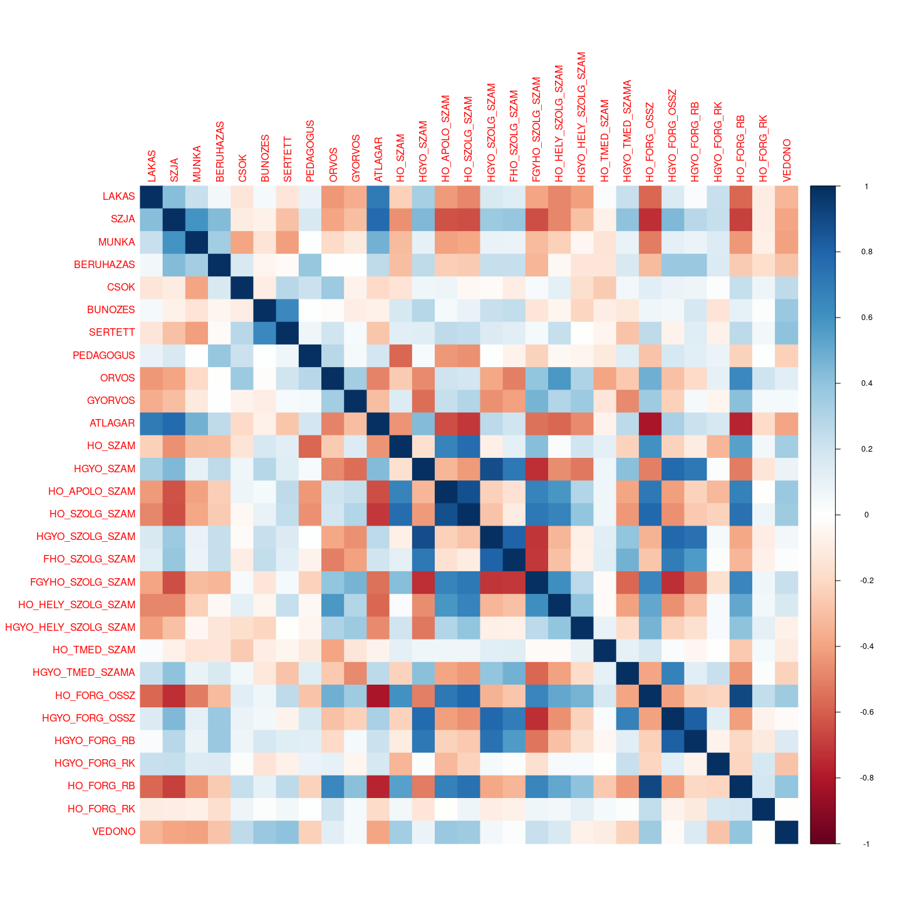
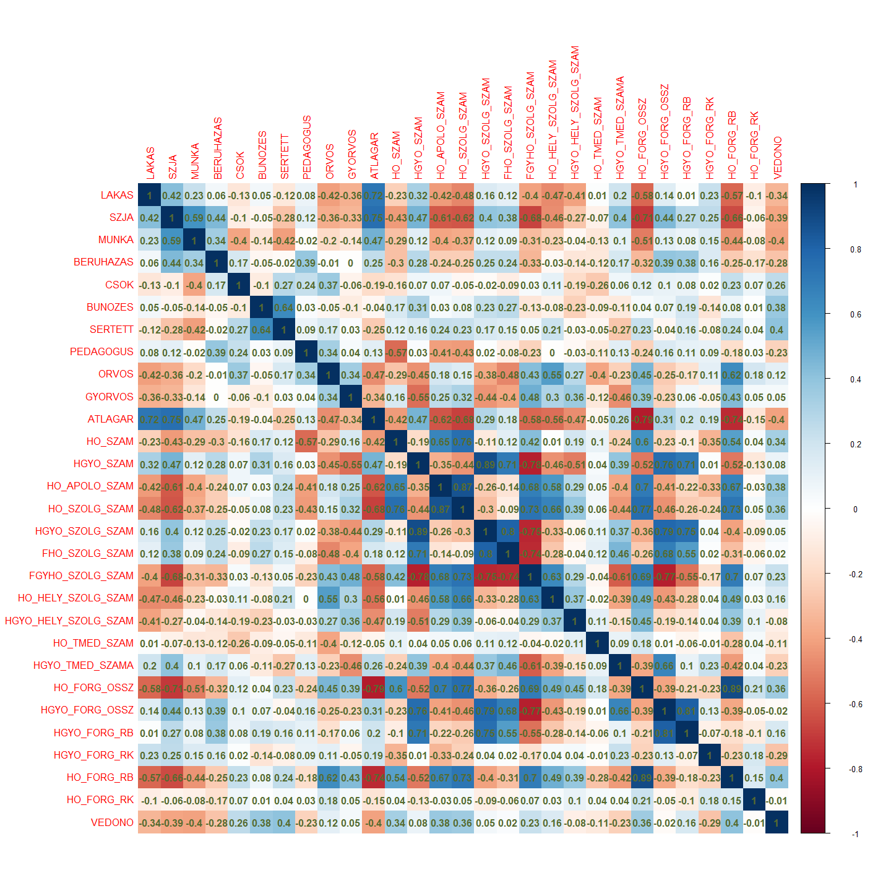
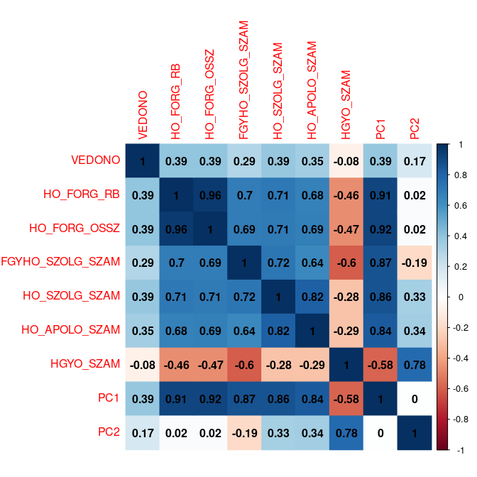
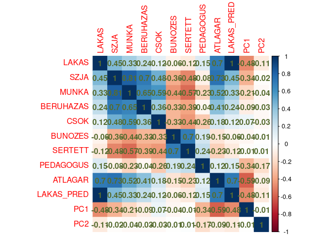
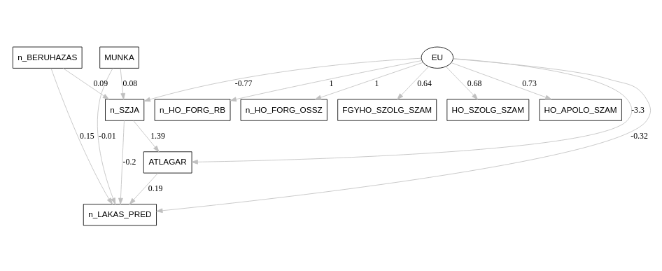

CSOK TDK
================

- [Kezdő beállítások](#kezdő-beállítások)
  - [Libraryk](#libraryk)
  - [Adatok beolvasása, átalakítása](#adatok-beolvasása-átalakítása)
    - [CSOK dummy meghatározása](#csok-dummy-meghatározása)
    - [Adatok pótlása GAM-al](#adatok-pótlása-gam-al)
- [Területi autokorreláció](#területi-autokorreláció)
  - [Szomszédsági mátrixok](#szomszédsági-mátrixok)
    - [Adatok felbontása Moranhoz és
      Gearyhez](#adatok-felbontása-moranhoz-és-gearyhez)
    - [Szomszédsági mátrixok
      létrehozása](#szomszédsági-mátrixok-létrehozása)
  - [Területi autokorreláció évente](#területi-autokorreláció-évente)
- [Leíró stat](#leíró-stat)
  - [Korrelációk](#korrelációk)
- [Panelmodell](#panelmodell)
  - [Eü főkomponensek](#eü-főkomponensek)
    - [Kiválasztás és df-hez adás](#kiválasztás-és-df-hez-adás)
    - [Főkomponensek elnevezése](#főkomponensek-elnevezése)
    - [Korr mtx a főkompokkal együtt](#korr-mtx-a-főkompokkal-együtt)
  - [Tesztek](#tesztek)
  - [Nem tudom mi legyen a cím itt](#nem-tudom-mi-legyen-a-cím-itt)
  - [Modellek](#modellek)
    - [AIC, BIC](#aic-bic)
- [SEM](#sem)
  - [Normalizált változókkal 2012](#normalizált-változókkal-2012)
  - [Csak PC1-es latensvaltozoval](#csak-pc1-es-latensvaltozoval)
    - [2012](#2012)
    - [2016-os adatokon](#2016-os-adatokon)
    - [2019-es adatokon](#2019-es-adatokon)
    - [Összes adaton](#összes-adaton)
    - [Próbálgatás](#próbálgatás)

# Kezdő beállítások

## Libraryk

``` r
knitr::opts_chunk$set(echo = TRUE)

library(tidyverse)
library(plm)
library(splm)
library(sp)
library(spdep)
library(mgcv)
library(lmtest)
library(psych)
library(ppcor)
library(corrplot)
library(lavaan)
library(lavaanPlot)
library(DiagrammeRsvg)
library(car)
```

## Adatok beolvasása, átalakítása

``` r
df = read.csv("Data/ExtendedDataset.csv")
```

### CSOK dummy meghatározása

Ez a medián a CSOK-os években

``` r
median(df$CSOK[df$EV > "2015"])
```

    ## [1] 74

``` r
df$JARAS_NEV = as.factor(df$JARAS_NEV)
df$EV = as.factor(df$EV)
```

A mediánnál elválasztva:

``` r
cuts = c(-Inf, 1, 75, Inf)
labs = c("nincs", "alacsony", "magas")

df$CSOKTREND = cut(df$CSOK, breaks = cuts, labels = labs, include.lowest = T)

rm(cuts, labs)
```

### Adatok pótlása GAM-al

#### Lakás GAM modell

``` r
gammodel = gam(LAKAS ~ s(X,Y, by = EV, k = 8), family = "gaussian", data = df, method = "REML")

predicted = predict(gammodel, df)
df$LAKAS_PRED = df$LAKAS

for (i in 1:nrow(df)) {
  if(is.na(df$LAKAS[i])){
    if(predicted[i] > 0){
      df$LAKAS_PRED[i] = predicted[i]
    }else{
      df$LAKAS_PRED[i] = 0
    }
  }
}
```

#### Eü adatok GAM modelljei

``` r
sapply(df[,20:37], function(x) sum(is.na(x)))
```

    ##              HO_SZAM            HGYO_SZAM        HO_APOLO_SZAM 
    ##                    0                   49                    0 
    ##        HO_SZOLG_SZAM      HGYO_SZOLG_SZAM       FHO_SZOLG_SZAM 
    ##                    0                   41                   40 
    ##     FGYHO_SZOLG_SZAM   HO_HELY_SZOLG_SZAM HGYO_HELY_SZOLG_SZAM 
    ##                   51                  446                 1159 
    ##         HO_TMED_SZAM      HGYO_TMED_SZAMA         HO_FORG_OSSZ 
    ##                 1575                 1582                    0 
    ##       HGYO_FORG_OSSZ         HGYO_FORG_RB         HGYO_FORG_RK 
    ##                   41                   41                   57 
    ##           HO_FORG_RB           HO_FORG_RK               VEDONO 
    ##                    0                    0                    0

##### FGYHO_SZOLG_SZAM

``` r
gammodel = gam(FGYHO_SZOLG_SZAM  ~ s(X,Y, by = EV, k = 8), family = "gaussian", data = df, method = "REML")

predicted = predict(gammodel, df)

for (i in 1:nrow(df)) {
  if(is.na(df$FGYHO_SZOLG_SZAM[i])){
    if(predicted[i] > 0){
      df$FGYHO_SZOLG_SZAM[i] = predicted[i]
    }else{
      df$FGYHO_SZOLG_SZAM[i] = 0
    }
  }
}
```

##### HGYO_SZAM

``` r
gammodel = gam(HGYO_SZAM ~ s(X,Y, by = EV, k = 8), family = "gaussian", data = df, method = "REML")

predicted = predict(gammodel, df)

for (i in 1:nrow(df)) {
  if(is.na(df$HGYO_SZAM[i])){
    if(predicted[i] > 0){
      df$HGYO_SZAM[i] = predicted[i]
    }else{
      df$HGYO_SZAM[i] = 0
    }
  }
}

rm(i, predicted, gammodel)
```

# Területi autokorreláció

## Szomszédsági mátrixok

### Adatok felbontása Moranhoz és Gearyhez

``` r
df2012 = filter(df, EV == 2012)
df2013 = filter(df, EV == 2013)
df2014 = filter(df, EV == 2014)
df2015 = filter(df, EV == 2015)
df2016 = filter(df, EV == 2016)
df2017 = filter(df, EV == 2017)
df2018 = filter(df, EV == 2018)
df2019 = filter(df, EV == 2019)
df2020 = filter(df, EV == 2020)
df2021 = filter(df, EV == 2021)
```

### Szomszédsági mátrixok létrehozása

``` r
listw32 = nb2listw(dnearneigh(df2016[,c(9,10)], 0, 32, longlat = T))
listw36 = nb2listw(dnearneigh(df2016[,c(9,10)], 0, 36, longlat = T))
listw40 = nb2listw(dnearneigh(df2016[,c(9,10)], 0, 40, longlat = T))
```

## Területi autokorreláció évente

``` r
# Moran, Geary 2016
moran(df2016$LAKAS_PRED, listw32, 175, 174, zero.policy = NULL, NAOK = F)
moran(df2016$LAKAS_PRED, listw36, 175, 174, zero.policy = NULL, NAOK = F)
moran(df2016$LAKAS_PRED, listw40, 175, 174, zero.policy = NULL, NAOK = F)
geary(df2016$LAKAS_PRED, listw32, 175, 174, Szero(listw32))
geary(df2016$LAKAS_PRED, listw36, 175, 174, Szero(listw36))
geary(df2016$LAKAS_PRED, listw40, 175, 174, Szero(listw40))

# Moran, Geary 2017
moran(df2017$LAKAS_PRED, listw32, 175, 174, zero.policy = NULL, NAOK = F)
moran(df2017$LAKAS_PRED, listw36, 175, 174, zero.policy = NULL, NAOK = F)
moran(df2017$LAKAS_PRED, listw40, 175, 174, zero.policy = NULL, NAOK = F)
geary(df2017$LAKAS_PRED, listw32, 175, 174, Szero(listw32))
geary(df2017$LAKAS_PRED, listw36, 175, 174, Szero(listw36))
geary(df2017$LAKAS_PRED, listw40, 175, 174, Szero(listw40))

# Moran, Geary 2018
moran(df2018$LAKAS_PRED, listw32, 175, 174, zero.policy = NULL, NAOK = F)
moran(df2018$LAKAS_PRED, listw36, 175, 174, zero.policy = NULL, NAOK = F)
moran(df2018$LAKAS_PRED, listw40, 175, 174, zero.policy = NULL, NAOK = F)
geary(df2018$LAKAS_PRED, listw32, 175, 174, Szero(listw32))
geary(df2018$LAKAS_PRED, listw36, 175, 174, Szero(listw36))
geary(df2018$LAKAS_PRED, listw40, 175, 174, Szero(listw40))

# Moran, Geary 2019
moran(df2019$LAKAS_PRED, listw32, 175, 174, zero.policy = NULL, NAOK = F)
moran(df2019$LAKAS_PRED, listw36, 175, 174, zero.policy = NULL, NAOK = F)
moran(df2019$LAKAS_PRED, listw40, 175, 174, zero.policy = NULL, NAOK = F)
geary(df2019$LAKAS_PRED, listw32, 175, 174, Szero(listw32))
geary(df2019$LAKAS_PRED, listw36, 175, 174, Szero(listw36))
geary(df2019$LAKAS_PRED, listw40, 175, 174, Szero(listw40))

# Moran, Geary 2020
moran(df2020$LAKAS_PRED, listw32, 175, 174, zero.policy = NULL, NAOK = F)
moran(df2020$LAKAS_PRED, listw36, 175, 174, zero.policy = NULL, NAOK = F)
moran(df2020$LAKAS_PRED, listw40, 175, 174, zero.policy = NULL, NAOK = F)
geary(df2020$LAKAS_PRED, listw32, 175, 174, Szero(listw32))
geary(df2020$LAKAS_PRED, listw36, 175, 174, Szero(listw36))
geary(df2020$LAKAS_PRED, listw40, 175, 174, Szero(listw40))
```

# Leíró stat

``` r
describe(df2012$LAKAS)
describe(df2013$LAKAS)
describe(df2014$LAKAS)
describe(df2015$LAKAS)
describe(df2016$LAKAS)
describe(df2017$LAKAS)
describe(df2018$LAKAS)
describe(df2019$LAKAS)
describe(df2020$LAKAS)
describe(df2021$LAKAS)
```

``` r
psych::describe(df2021$ATLAGAR)
```

    ##    vars   n  mean    sd median trimmed  mad min   max range skew kurtosis   se
    ## X1    1 175 15.74 11.78  11.69   13.54 7.02   3 68.51 65.51 2.01     4.58 0.89

## Korrelációk

``` r
cor(df[,c(4:8,14:19)], use = "complete.obs")
```

    ##                 LAKAS       SZJA       MUNKA   BERUHAZAS        CSOK
    ## LAKAS      1.00000000  0.4524761  0.37681306  0.21970624  0.02798068
    ## SZJA       0.45247607  1.0000000  0.76176321  0.65480917  0.15495230
    ## MUNKA      0.37681306  0.7617632  1.00000000  0.55171493  0.19346516
    ## BERUHAZAS  0.21970624  0.6548092  0.55171493  1.00000000  0.09673088
    ## CSOK       0.02798068  0.1549523  0.19346516  0.09673088  1.00000000
    ## BUNOZES   -0.05715594 -0.2520321 -0.25982415 -0.21406135 -0.08827811
    ## SERTETT   -0.14519939 -0.4786846 -0.51769037 -0.31142199 -0.19991632
    ## PEDAGOGUS  0.23637629  0.1830092  0.07755174  0.16020173 -0.07238756
    ## ORVOS     -0.33984858 -0.3451780 -0.30159493 -0.10513064  0.17688275
    ## GYORVOS   -0.08994859 -0.1652809 -0.12108496 -0.05896689  0.02580778
    ## ATLAGAR    0.69680891  0.7430468  0.55728901  0.38713991  0.01480768
    ##               BUNOZES    SERTETT   PEDAGOGUS       ORVOS     GYORVOS
    ## LAKAS     -0.05715594 -0.1451994  0.23637629 -0.33984858 -0.08994859
    ## SZJA      -0.25203211 -0.4786846  0.18300918 -0.34517798 -0.16528087
    ## MUNKA     -0.25982415 -0.5176904  0.07755174 -0.30159493 -0.12108496
    ## BERUHAZAS -0.21406135 -0.3114220  0.16020173 -0.10513064 -0.05896689
    ## CSOK      -0.08827811 -0.1999163 -0.07238756  0.17688275  0.02580778
    ## BUNOZES    1.00000000  0.5331466  0.03582450  0.05974800  0.06137758
    ## SERTETT    0.53314655  1.0000000  0.10062095  0.17288650  0.14297398
    ## PEDAGOGUS  0.03582450  0.1006210  1.00000000  0.06395328  0.07404506
    ## ORVOS      0.05974800  0.1728865  0.06395328  1.00000000  0.14647215
    ## GYORVOS    0.06137758  0.1429740  0.07404506  0.14647215  1.00000000
    ## ATLAGAR   -0.10765804 -0.2622687  0.27325799 -0.45604068 -0.15125215
    ##               ATLAGAR
    ## LAKAS      0.69680891
    ## SZJA       0.74304678
    ## MUNKA      0.55728901
    ## BERUHAZAS  0.38713991
    ## CSOK       0.01480768
    ## BUNOZES   -0.10765804
    ## SERTETT   -0.26226871
    ## PEDAGOGUS  0.27325799
    ## ORVOS     -0.45604068
    ## GYORVOS   -0.15125215
    ## ATLAGAR    1.00000000

``` r
corrplot(cor(df[,c(4:8,14:37)], use = "complete.obs"), method = "color")
```

<!-- -->

``` r
corrplot(cor(df[,c(4:8,14:37)], use = "complete.obs"), method = "color", addCoef.col = "darkolivegreen")
```

<!-- -->

``` r
pcor(na.omit(df[,c(4:8,38:41)]))$estimate
```

    ## Error in `[.data.frame`(df, , c(4:8, 38:41)): undefined columns selected

``` r
corrplot(pcor(na.omit(df[,c(4:8,14:16,19,38:40)]))$estimate, method = "color")
```

    ## Error in `[.data.frame`(df, , c(4:8, 14:16, 19, 38:40)): undefined columns selected

itt a nagy kép:

``` r
knitr::include_graphics("tdk_files/figure-gfm/parcialis corrplot-1.png")
```


# Panelmodell

## Eü főkomponensek

\### Főkomponensek létehozása

``` r
fokompok = prcomp(df[,c("VEDONO", "HO_FORG_RB", "HO_FORG_OSSZ", "FGYHO_SZOLG_SZAM", "HO_SZOLG_SZAM", "HO_APOLO_SZAM", "HGYO_SZAM")], center = TRUE, scale=TRUE)

summary(fokompok)
```

    ## Importance of components:
    ##                           PC1    PC2     PC3    PC4     PC5     PC6     PC7
    ## Standard deviation     2.0970 1.0020 0.83167 0.6787 0.50551 0.38691 0.20237
    ## Proportion of Variance 0.6282 0.1434 0.09881 0.0658 0.03651 0.02139 0.00585
    ## Cumulative Proportion  0.6282 0.7716 0.87045 0.9363 0.97276 0.99415 1.00000

### Kiválasztás és df-hez adás

``` r
df = cbind(df, fokompok$x[,1:3])
```

``` r
corrplot(cor(df[,c("VEDONO", "HO_FORG_RB", "HO_FORG_OSSZ", "FGYHO_SZOLG_SZAM", "HO_SZOLG_SZAM", "HO_APOLO_SZAM", "HGYO_SZAM", "PC1", "PC2", "PC3")]), method = "color", addCoef.col = "black")
```

<!-- -->

Ez így nem jó, nem lehet meghatározni a PC2 és PC3-at, mert mind a
VEDONO, mind a HGYO_SZAM korrelál vele.

``` r
fokompok = prcomp(df[,c("HO_FORG_RB", "HO_FORG_OSSZ", "FGYHO_SZOLG_SZAM", "HO_SZOLG_SZAM", "HO_APOLO_SZAM", "HGYO_SZAM")], center = TRUE, scale=TRUE)

summary(fokompok)
```

    ## Importance of components:
    ##                           PC1    PC2     PC3     PC4    PC5     PC6
    ## Standard deviation     2.0516 0.9336 0.68701 0.50628 0.3873 0.20237
    ## Proportion of Variance 0.7015 0.1453 0.07866 0.04272 0.0250 0.00683
    ## Cumulative Proportion  0.7015 0.8468 0.92545 0.96817 0.9932 1.00000

``` r
df[,c("PC1", "PC2")] = fokompok$x[,1:2]
```

Akkor a VEDONO és elhagyásával járok jobban(source: próbálgatás).

``` r
corrplot(cor(df[,c("VEDONO", "HO_FORG_RB", "HO_FORG_OSSZ", "FGYHO_SZOLG_SZAM", "HO_SZOLG_SZAM", "HO_APOLO_SZAM", "HGYO_SZAM", "PC1", "PC2")]), method = "color", addCoef.col = "black")
```

<!-- -->

### Főkomponensek elnevezése

Mik lehetnek az egyes főkomponensek?

- PC1: rendelők nagysága/leterheltsége
- PC2: gyermekorvosok száma

### Korr mtx a főkompokkal együtt

``` r
corrplot(cor(df[,c(4:8,14:16,19,38:40)], use = "complete.obs"), method = "color", addCoef.col = "darkolivegreen")
```

<!-- -->

## Tesztek

``` r
phtest(LAKAS_PRED ~ SZJA + MUNKA + BERUHAZAS + CSOKTREND + BUNOZES + SERTETT + PEDAGOGUS + ATLAGAR + VEDONO + PC1 + PC2, df, index = c("JARAS_NEV", "EV"))
```

    ## 
    ##  Hausman Test
    ## 
    ## data:  LAKAS_PRED ~ SZJA + MUNKA + BERUHAZAS + CSOKTREND + BUNOZES +  ...
    ## chisq = 102.16, df = 12, p-value < 2.2e-16
    ## alternative hypothesis: one model is inconsistent

``` r
pFtest(LAKAS_PRED ~ SZJA + MUNKA + BERUHAZAS + CSOKTREND + BUNOZES + SERTETT + PEDAGOGUS + ATLAGAR + VEDONO + PC1 + PC2, df, index = c("JARAS_NEV", "EV"))
```

    ## 
    ##  F test for individual effects
    ## 
    ## data:  LAKAS_PRED ~ SZJA + MUNKA + BERUHAZAS + CSOKTREND + BUNOZES +  ...
    ## F = 6.0579, df1 = 174, df2 = 1563, p-value < 2.2e-16
    ## alternative hypothesis: significant effects

Mindkét teszt p-értéke 2.2 $\times$ 10<sup>-16</sup>, vagyis szinte 0.
Ezt azt jelenti, hogy mindkét esetben el lehet vetni a nullhipotézist.

A Hausmann teszt nullhipotzise az, hogy a random modell a megfelelő a
fix hatásúval szemben. Ezt elvethetjük.

A globális F próba nullhipotézise szerint a Pooled OLS modell a
megfelelő, csakugyan a fix hatásúval szemben. Ezt is elvethetjük.

Tehát a panelmodell fix hatású lesz.

## Nem tudom mi legyen a cím itt

``` r
df2 = df %>% arrange(EV)
listw36 = nb2listw(dnearneigh(df2[df2$EV == "2016",c(9,10)], 0, 36, longlat = T), style = "W")
```

## Modellek

``` r
paic = function(model){
  return(2 * (length(model$coefficients) + 1) - 2 * model$logLik)
}

pbic = function(model){
 return(-2 * model$logLik + (length(model$coefficients)+1)*log(nrow(model$model)))
}
```

#### Modell 1

CSOK dummy: “nincs”, “alacsony”,“közepes”, “magas”

``` r
cuts = c(-Inf, 1, 70, 86, Inf)
labs = c("nincs", "alacsony","közepes", "magas")
df2$CSOKTREND = cut(df2$CSOK, breaks = cuts, labels = labs, include.lowest = T)

model1_0 = spml(LAKAS_PRED ~ SZJA + MUNKA + BERUHAZAS + CSOKTREND + BUNOZES + SERTETT + PEDAGOGUS + ATLAGAR + VEDONO + PC1 + PC2, df2,
              listw = listw36, model = "within", index = c("JARAS_NEV", "EV"), lag = T,
              effect = "individual", spatial.error = "none")

summary(model1_0)
```

    ## Spatial panel fixed effects lag model
    ##  
    ## 
    ## Call:
    ## spml(formula = LAKAS_PRED ~ SZJA + MUNKA + BERUHAZAS + CSOKTREND + 
    ##     BUNOZES + SERTETT + PEDAGOGUS + ATLAGAR + VEDONO + PC1 + 
    ##     PC2, data = df2, index = c("JARAS_NEV", "EV"), listw = listw36, 
    ##     model = "within", effect = "individual", lag = T, spatial.error = "none")
    ## 
    ## Residuals:
    ##      Min.   1st Qu.    Median   3rd Qu.      Max. 
    ## -41.16936  -2.35093  -0.26746   1.85967 115.02179 
    ## 
    ## Spatial autoregressive coefficient:
    ##        Estimate Std. Error t-value  Pr(>|t|)    
    ## lambda 0.334465   0.031949  10.469 < 2.2e-16 ***
    ## 
    ## Coefficients:
    ##                      Estimate  Std. Error t-value  Pr(>|t|)    
    ## SZJA              -4.1749e-03  2.3311e-03 -1.7910 0.0732978 .  
    ## MUNKA              1.8481e-02  1.0173e-01  0.1817 0.8558504    
    ## BERUHAZAS         -4.3045e-03  1.3503e-03 -3.1877 0.0014339 ** 
    ## CSOKTRENDalacsony  2.4397e+00  9.6247e-01  2.5348 0.0112502 *  
    ## CSOKTRENDközepes   3.0051e+00  7.8888e-01  3.8093 0.0001394 ***
    ## CSOKTRENDmagas     7.3648e-01  7.4179e-01  0.9928 0.3207843    
    ## BUNOZES           -8.1145e-05  1.7088e-04 -0.4749 0.6348862    
    ## SERTETT           -6.0537e-04  3.9226e-04 -1.5433 0.1227604    
    ## PEDAGOGUS          4.3912e-01  4.6188e-01  0.9507 0.3417377    
    ## ATLAGAR            1.0233e+00  8.7992e-02 11.6290 < 2.2e-16 ***
    ## VEDONO            -3.7488e-01  5.3680e-01 -0.6984 0.4849452    
    ## PC1               -1.5222e+00  5.9662e-01 -2.5514 0.0107295 *  
    ## PC2               -9.2588e-01  5.5001e-01 -1.6834 0.0923023 .  
    ## ---
    ## Signif. codes:  0 '***' 0.001 '**' 0.01 '*' 0.05 '.' 0.1 ' ' 1

``` r
model1_1 = spml(LAKAS_PRED ~ SZJA  + BERUHAZAS + CSOKTREND  + SERTETT  + ATLAGAR + PC1 + PC2, df2,
              listw = listw36, model = "within", index = c("JARAS_NEV", "EV"), lag = T,
              effect = "individual", spatial.error = "none")

summary(model1_1)
```

    ## Spatial panel fixed effects lag model
    ##  
    ## 
    ## Call:
    ## spml(formula = LAKAS_PRED ~ SZJA + BERUHAZAS + CSOKTREND + SERTETT + 
    ##     ATLAGAR + PC1 + PC2, data = df2, index = c("JARAS_NEV", "EV"), 
    ##     listw = listw36, model = "within", effect = "individual", 
    ##     lag = T, spatial.error = "none")
    ## 
    ## Residuals:
    ##     Min.  1st Qu.   Median  3rd Qu.     Max. 
    ## -41.4239  -2.2894  -0.2844   1.8586 115.0847 
    ## 
    ## Spatial autoregressive coefficient:
    ##        Estimate Std. Error t-value  Pr(>|t|)    
    ## lambda 0.336772   0.031794  10.592 < 2.2e-16 ***
    ## 
    ## Coefficients:
    ##                      Estimate  Std. Error t-value  Pr(>|t|)    
    ## SZJA              -0.00425377  0.00179515 -2.3696 0.0178079 *  
    ## BERUHAZAS         -0.00426167  0.00134446 -3.1698 0.0015254 ** 
    ## CSOKTRENDalacsony  2.31263803  0.93010636  2.4864 0.0129034 *  
    ## CSOKTRENDközepes   2.84225552  0.74755859  3.8021 0.0001435 ***
    ## CSOKTRENDmagas     0.59852118  0.65895894  0.9083 0.3637287    
    ## SERTETT           -0.00069041  0.00033112 -2.0851 0.0370634 *  
    ## ATLAGAR            1.03972200  0.08411001 12.3615 < 2.2e-16 ***
    ## PC1               -1.55503557  0.58933697 -2.6386 0.0083245 ** 
    ## PC2               -0.95478725  0.54560891 -1.7499 0.0801273 .  
    ## ---
    ## Signif. codes:  0 '***' 0.001 '**' 0.01 '*' 0.05 '.' 0.1 ' ' 1

``` r
paic(model1_0)
```

    ## [1] 11934.01

``` r
paic(model1_1)
```

    ## [1] 11927.62

``` r
pbic(model1_0)
```

    ## [1] 12016.02

``` r
pbic(model1_1)
```

    ## [1] 11987.76

AIC, BIC preferálja a szűkített modellt.

``` r
model1 = model1_1
```

#### Modell 2

CSOK dummy: “nincs”, “alacsony”, “magas”

``` r
cuts = c(-Inf, 1, 75, Inf)
labs = c("nincs", "alacsony", "magas")
df2$CSOKTREND = cut(df2$CSOK, breaks = cuts, labels = labs, include.lowest = T)
rm(cuts, labs)

model2_0 = spml(LAKAS_PRED ~ SZJA + MUNKA + BERUHAZAS + CSOKTREND + BUNOZES + SERTETT + PEDAGOGUS + ATLAGAR+ VEDONO + PC1 + PC2, df2,
              listw = listw36, model = "within", index = c("JARAS_NEV", "EV"), lag = T,
              effect = "individual", spatial.error = "none")

summary(model2_0)
```

    ## Spatial panel fixed effects lag model
    ##  
    ## 
    ## Call:
    ## spml(formula = LAKAS_PRED ~ SZJA + MUNKA + BERUHAZAS + CSOKTREND + 
    ##     BUNOZES + SERTETT + PEDAGOGUS + ATLAGAR + VEDONO + PC1 + 
    ##     PC2, data = df2, index = c("JARAS_NEV", "EV"), listw = listw36, 
    ##     model = "within", effect = "individual", lag = T, spatial.error = "none")
    ## 
    ## Residuals:
    ##      Min.   1st Qu.    Median   3rd Qu.      Max. 
    ## -40.93310  -2.31098  -0.29695   1.82221 114.95407 
    ## 
    ## Spatial autoregressive coefficient:
    ##        Estimate Std. Error t-value  Pr(>|t|)    
    ## lambda 0.339461   0.031887  10.646 < 2.2e-16 ***
    ## 
    ## Coefficients:
    ##                      Estimate  Std. Error t-value  Pr(>|t|)    
    ## SZJA              -3.2944e-03  2.3058e-03 -1.4287  0.153078    
    ## MUNKA             -1.9731e-02  1.0168e-01 -0.1940  0.846141    
    ## BERUHAZAS         -4.3958e-03  1.3543e-03 -3.2457  0.001172 ** 
    ## CSOKTRENDalacsony  2.6056e+00  8.6586e-01  3.0093  0.002619 ** 
    ## CSOKTRENDmagas     1.4993e+00  6.9522e-01  2.1566  0.031034 *  
    ## BUNOZES           -7.6554e-05  1.7124e-04 -0.4471  0.654835    
    ## SERTETT           -6.6491e-04  3.9215e-04 -1.6956  0.089970 .  
    ## PEDAGOGUS          3.4458e-01  4.6233e-01  0.7453  0.456091    
    ## ATLAGAR            9.9054e-01  8.7231e-02 11.3554 < 2.2e-16 ***
    ## VEDONO            -4.4166e-01  5.3613e-01 -0.8238  0.410054    
    ## PC1               -1.5278e+00  5.9779e-01 -2.5558  0.010595 *  
    ## PC2               -9.2257e-01  5.5183e-01 -1.6718  0.094556 .  
    ## ---
    ## Signif. codes:  0 '***' 0.001 '**' 0.01 '*' 0.05 '.' 0.1 ' ' 1

``` r
model2_1 = spml(LAKAS_PRED ~ SZJA + BERUHAZAS + CSOKTREND + SERTETT + ATLAGAR + PC1 + PC2, df2,
              listw = listw36, model = "within", index = c("JARAS_NEV", "EV"), lag = T,
              effect = "individual", spatial.error = "none")

summary(model2_1)
```

    ## Spatial panel fixed effects lag model
    ##  
    ## 
    ## Call:
    ## spml(formula = LAKAS_PRED ~ SZJA + BERUHAZAS + CSOKTREND + SERTETT + 
    ##     ATLAGAR + PC1 + PC2, data = df2, index = c("JARAS_NEV", "EV"), 
    ##     listw = listw36, model = "within", effect = "individual", 
    ##     lag = T, spatial.error = "none")
    ## 
    ## Residuals:
    ##      Min.   1st Qu.    Median   3rd Qu.      Max. 
    ## -41.18165  -2.26755  -0.32048   1.80800 114.93781 
    ## 
    ## Spatial autoregressive coefficient:
    ##        Estimate Std. Error t-value  Pr(>|t|)    
    ## lambda 0.342387   0.031719  10.794 < 2.2e-16 ***
    ## 
    ## Coefficients:
    ##                      Estimate  Std. Error t-value  Pr(>|t|)    
    ## SZJA              -0.00391371  0.00177554 -2.2042  0.027507 *  
    ## BERUHAZAS         -0.00438735  0.00134755 -3.2558  0.001131 ** 
    ## CSOKTRENDalacsony  2.42113995  0.83234196  2.9088  0.003628 ** 
    ## CSOKTRENDmagas     1.27833311  0.61956739  2.0633  0.039087 *  
    ## SERTETT           -0.00072349  0.00033115 -2.1848  0.028906 *  
    ## ATLAGAR            1.01539173  0.08365404 12.1380 < 2.2e-16 ***
    ## PC1               -1.58840188  0.59045580 -2.6901  0.007142 ** 
    ## PC2               -0.97213636  0.54700891 -1.7772  0.075538 .  
    ## ---
    ## Signif. codes:  0 '***' 0.001 '**' 0.01 '*' 0.05 '.' 0.1 ' ' 1

``` r
paic(model2_0)
```

    ## [1] 11940.1

``` r
paic(model2_1)
```

    ## [1] 11933.74

``` r
pbic(model2_0)
```

    ## [1] 12016.64

``` r
pbic(model2_1)
```

    ## [1] 11988.41

AIC, BIC preferálja a szűkített modellt.

``` r
model2 = model2_1
```

#### Modell 3

CSOK számként

``` r
model3_0 = spml(LAKAS_PRED ~ SZJA + MUNKA + BERUHAZAS + CSOK + BUNOZES + SERTETT + PEDAGOGUS + ATLAGAR + VEDONO + PC1 + PC2, df2,
              listw = listw36, model = "within", index = c("JARAS_NEV", "EV"), lag = T,
              effect = "individual", spatial.error = "none")

summary(model3_0)
```

    ## Spatial panel fixed effects lag model
    ##  
    ## 
    ## Call:
    ## spml(formula = LAKAS_PRED ~ SZJA + MUNKA + BERUHAZAS + CSOK + 
    ##     BUNOZES + SERTETT + PEDAGOGUS + ATLAGAR + VEDONO + PC1 + 
    ##     PC2, data = df2, index = c("JARAS_NEV", "EV"), listw = listw36, 
    ##     model = "within", effect = "individual", lag = T, spatial.error = "none")
    ## 
    ## Residuals:
    ##      Min.   1st Qu.    Median   3rd Qu.      Max. 
    ## -41.68965  -2.28237  -0.29391   1.79334 115.08427 
    ## 
    ## Spatial autoregressive coefficient:
    ##        Estimate Std. Error t-value  Pr(>|t|)    
    ## lambda 0.352225   0.031469  11.193 < 2.2e-16 ***
    ## 
    ## Coefficients:
    ##              Estimate  Std. Error t-value  Pr(>|t|)    
    ## SZJA      -1.5797e-03  2.1730e-03 -0.7270  0.467246    
    ## MUNKA     -5.0121e-02  1.0080e-01 -0.4972  0.619038    
    ## BERUHAZAS -4.4124e-03  1.3557e-03 -3.2546  0.001135 ** 
    ## CSOK       1.4477e-02  7.6444e-03  1.8938  0.058245 .  
    ## BUNOZES   -7.6084e-05  1.7134e-04 -0.4440  0.657009    
    ## SERTETT   -6.9099e-04  3.9224e-04 -1.7617  0.078127 .  
    ## PEDAGOGUS  1.8803e-01  4.5788e-01  0.4106  0.681330    
    ## ATLAGAR    1.0011e+00  8.7568e-02 11.4318 < 2.2e-16 ***
    ## VEDONO    -5.0964e-01  5.3570e-01 -0.9514  0.341427    
    ## PC1       -1.5722e+00  5.9727e-01 -2.6323  0.008480 ** 
    ## PC2       -8.5015e-01  5.5112e-01 -1.5426  0.122933    
    ## ---
    ## Signif. codes:  0 '***' 0.001 '**' 0.01 '*' 0.05 '.' 0.1 ' ' 1

``` r
model3_1 = spml(LAKAS_PRED ~ SZJA  + BERUHAZAS + CSOK + SERTETT + ATLAGAR + PC1 + PC2, df2,
              listw = listw36, model = "within", index = c("JARAS_NEV", "EV"), lag = T,
              effect = "individual", spatial.error = "none")

summary(model3_1)
```

    ## Spatial panel fixed effects lag model
    ##  
    ## 
    ## Call:
    ## spml(formula = LAKAS_PRED ~ SZJA + BERUHAZAS + CSOK + SERTETT + 
    ##     ATLAGAR + PC1 + PC2, data = df2, index = c("JARAS_NEV", "EV"), 
    ##     listw = listw36, model = "within", effect = "individual", 
    ##     lag = T, spatial.error = "none")
    ## 
    ## Residuals:
    ##     Min.  1st Qu.   Median  3rd Qu.     Max. 
    ## -41.8629  -2.2233  -0.3199   1.7481 114.9608 
    ## 
    ## Spatial autoregressive coefficient:
    ##        Estimate Std. Error t-value  Pr(>|t|)    
    ## lambda 0.355354   0.031325  11.344 < 2.2e-16 ***
    ## 
    ## Coefficients:
    ##              Estimate  Std. Error t-value  Pr(>|t|)    
    ## SZJA      -0.00257700  0.00167474 -1.5387 0.1238661    
    ## BERUHAZAS -0.00445650  0.00134833 -3.3052 0.0009491 ***
    ## CSOK       0.01171637  0.00678153  1.7277 0.0840440 .  
    ## SERTETT   -0.00074205  0.00033131 -2.2397 0.0251086 *  
    ## ATLAGAR    1.02811862  0.08416086 12.2161 < 2.2e-16 ***
    ## PC1       -1.64544396  0.58951316 -2.7912 0.0052514 ** 
    ## PC2       -0.90554422  0.54682958 -1.6560 0.0977239 .  
    ## ---
    ## Signif. codes:  0 '***' 0.001 '**' 0.01 '*' 0.05 '.' 0.1 ' ' 1

``` r
model3_2 = spml(LAKAS_PRED ~ BERUHAZAS + CSOK + SERTETT + ATLAGAR + PC1 + PC2, df2,
              listw = listw36, model = "within", index = c("JARAS_NEV", "EV"), lag = T,
              effect = "individual", spatial.error = "none")

summary(model3_2)
```

    ## Spatial panel fixed effects lag model
    ##  
    ## 
    ## Call:
    ## spml(formula = LAKAS_PRED ~ BERUHAZAS + CSOK + SERTETT + ATLAGAR + 
    ##     PC1 + PC2, data = df2, index = c("JARAS_NEV", "EV"), listw = listw36, 
    ##     model = "within", effect = "individual", lag = T, spatial.error = "none")
    ## 
    ## Residuals:
    ##      Min.   1st Qu.    Median   3rd Qu.      Max. 
    ## -40.79970  -2.28129  -0.25005   1.77701 115.29025 
    ## 
    ## Spatial autoregressive coefficient:
    ##        Estimate Std. Error t-value  Pr(>|t|)    
    ## lambda 0.347068   0.031386  11.058 < 2.2e-16 ***
    ## 
    ## Coefficients:
    ##              Estimate  Std. Error t-value  Pr(>|t|)    
    ## BERUHAZAS -0.00566403  0.00108974 -5.1976 2.019e-07 ***
    ## CSOK       0.00623925  0.00573560  1.0878   0.27668    
    ## SERTETT   -0.00062998  0.00032326 -1.9489   0.05131 .  
    ## ATLAGAR    0.94973092  0.06603832 14.3815 < 2.2e-16 ***
    ## PC1       -1.83090936  0.58016963 -3.1558   0.00160 ** 
    ## PC2       -0.91763770  0.54747765 -1.6761   0.09371 .  
    ## ---
    ## Signif. codes:  0 '***' 0.001 '**' 0.01 '*' 0.05 '.' 0.1 ' ' 1

``` r
paic(model3_0)
```

    ## [1] 11943.54

``` r
paic(model3_1)
```

    ## [1] 11937.2

``` r
paic(model3_2)
```

    ## [1] 11937.51

``` r
pbic(model3_0)
```

    ## [1] 12014.62

``` r
pbic(model3_1)
```

    ## [1] 11986.4

``` r
pbic(model3_2)
```

    ## [1] 11981.24

AIC modell3_1-et preferálja, BIC modell3_2-t. BIC mellett döntök.

``` r
model3 = model3_2
```

#### Modell 4

CSOK nélkül

``` r
model4_0 = spml(LAKAS_PRED ~ SZJA + MUNKA + BERUHAZAS + BUNOZES + SERTETT + PEDAGOGUS + ATLAGAR + VEDONO + PC1 + PC2, df2,
              listw = listw36, model = "within", index = c("JARAS_NEV", "EV"), lag = T,
              effect = "individual", spatial.error = "none")

summary(model4_0)
```

    ## Spatial panel fixed effects lag model
    ##  
    ## 
    ## Call:
    ## spml(formula = LAKAS_PRED ~ SZJA + MUNKA + BERUHAZAS + BUNOZES + 
    ##     SERTETT + PEDAGOGUS + ATLAGAR + VEDONO + PC1 + PC2, data = df2, 
    ##     index = c("JARAS_NEV", "EV"), listw = listw36, model = "within", 
    ##     effect = "individual", lag = T, spatial.error = "none")
    ## 
    ## Residuals:
    ##      Min.   1st Qu.    Median   3rd Qu.      Max. 
    ## -41.54154  -2.24867  -0.27788   1.74321 115.04944 
    ## 
    ## Spatial autoregressive coefficient:
    ##        Estimate Std. Error t-value  Pr(>|t|)    
    ## lambda 0.354034   0.031468  11.251 < 2.2e-16 ***
    ## 
    ## Coefficients:
    ##              Estimate  Std. Error t-value  Pr(>|t|)    
    ## SZJA      -1.1122e-03  2.1606e-03 -0.5147 0.6067309    
    ## MUNKA      1.8616e-02  9.4067e-02  0.1979 0.8431241    
    ## BERUHAZAS -4.9742e-03  1.3242e-03 -3.7563 0.0001724 ***
    ## BUNOZES   -5.9768e-05  1.7128e-04 -0.3490 0.7271183    
    ## SERTETT   -7.4981e-04  3.9133e-04 -1.9160 0.0553604 .  
    ## PEDAGOGUS  8.9962e-02  4.5531e-01  0.1976 0.8433712    
    ## ATLAGAR    9.8124e-01  8.6948e-02 11.2854 < 2.2e-16 ***
    ## VEDONO    -4.9154e-01  5.3609e-01 -0.9169 0.3592027    
    ## PC1       -1.6061e+00  5.9745e-01 -2.6882 0.0071836 ** 
    ## PC2       -8.5975e-01  5.5158e-01 -1.5587 0.1190691    
    ## ---
    ## Signif. codes:  0 '***' 0.001 '**' 0.01 '*' 0.05 '.' 0.1 ' ' 1

``` r
model4_1 = spml(LAKAS_PRED ~ SZJA + BERUHAZAS + SERTETT + ATLAGAR + PC1 + PC2, df2,
              listw = listw36, model = "within", index = c("JARAS_NEV", "EV"), lag = T,
              effect = "individual", spatial.error = "none")

summary(model4_1)
```

    ## Spatial panel fixed effects lag model
    ##  
    ## 
    ## Call:
    ## spml(formula = LAKAS_PRED ~ SZJA + BERUHAZAS + SERTETT + ATLAGAR + 
    ##     PC1 + PC2, data = df2, index = c("JARAS_NEV", "EV"), listw = listw36, 
    ##     model = "within", effect = "individual", lag = T, spatial.error = "none")
    ## 
    ## Residuals:
    ##      Min.   1st Qu.    Median   3rd Qu.      Max. 
    ## -41.56431  -2.19050  -0.29791   1.74012 114.99265 
    ## 
    ## Spatial autoregressive coefficient:
    ##        Estimate Std. Error t-value  Pr(>|t|)    
    ## lambda 0.355043   0.031365   11.32 < 2.2e-16 ***
    ## 
    ## Coefficients:
    ##              Estimate  Std. Error t-value  Pr(>|t|)    
    ## SZJA      -0.00101883  0.00141572 -0.7197 0.4717404    
    ## BERUHAZAS -0.00504408  0.00130583 -3.8627 0.0001121 ***
    ## SERTETT   -0.00084647  0.00032605 -2.5961 0.0094280 ** 
    ## ATLAGAR    0.98741472  0.08078999 12.2220 < 2.2e-16 ***
    ## PC1       -1.60051201  0.58947899 -2.7151 0.0066250 ** 
    ## PC2       -0.86230741  0.54672195 -1.5772 0.1147421    
    ## ---
    ## Signif. codes:  0 '***' 0.001 '**' 0.01 '*' 0.05 '.' 0.1 ' ' 1

``` r
model4_2 = spml(LAKAS_PRED ~ BERUHAZAS + SERTETT + ATLAGAR + PC1 + PC2, df2,
              listw = listw36, model = "within", index = c("JARAS_NEV", "EV"), lag = T,
              effect = "individual", spatial.error = "none")

summary(model4_2)
```

    ## Spatial panel fixed effects lag model
    ##  
    ## 
    ## Call:
    ## spml(formula = LAKAS_PRED ~ BERUHAZAS + SERTETT + ATLAGAR + PC1 + 
    ##     PC2, data = df2, index = c("JARAS_NEV", "EV"), listw = listw36, 
    ##     model = "within", effect = "individual", lag = T, spatial.error = "none")
    ## 
    ## Residuals:
    ##      Min.   1st Qu.    Median   3rd Qu.      Max. 
    ## -41.05520  -2.22611  -0.27883   1.74199 115.16601 
    ## 
    ## Spatial autoregressive coefficient:
    ##        Estimate Std. Error t-value  Pr(>|t|)    
    ## lambda 0.350561   0.031256  11.216 < 2.2e-16 ***
    ## 
    ## Coefficients:
    ##              Estimate  Std. Error t-value  Pr(>|t|)    
    ## BERUHAZAS -0.00555821  0.00108471 -5.1241 2.989e-07 ***
    ## SERTETT   -0.00075780  0.00030051 -2.5218  0.011677 *  
    ## ATLAGAR    0.95469555  0.06592222 14.4822 < 2.2e-16 ***
    ## PC1       -1.71429181  0.57149834 -2.9996  0.002703 ** 
    ## PC2       -0.88010852  0.54652397 -1.6104  0.107316    
    ## ---
    ## Signif. codes:  0 '***' 0.001 '**' 0.01 '*' 0.05 '.' 0.1 ' ' 1

``` r
model4_3 = spml(LAKAS_PRED ~ BERUHAZAS + SERTETT + ATLAGAR + PC1, df2,
              listw = listw36, model = "within", index = c("JARAS_NEV", "EV"), lag = T,
              effect = "individual", spatial.error = "none")

summary(model4_3)
```

    ## Spatial panel fixed effects lag model
    ##  
    ## 
    ## Call:
    ## spml(formula = LAKAS_PRED ~ BERUHAZAS + SERTETT + ATLAGAR + PC1, 
    ##     data = df2, index = c("JARAS_NEV", "EV"), listw = listw36, 
    ##     model = "within", effect = "individual", lag = T, spatial.error = "none")
    ## 
    ## Residuals:
    ##      Min.   1st Qu.    Median   3rd Qu.      Max. 
    ## -41.43348  -2.17797  -0.28075   1.79870 115.13108 
    ## 
    ## Spatial autoregressive coefficient:
    ##        Estimate Std. Error t-value  Pr(>|t|)    
    ## lambda 0.352327   0.031262   11.27 < 2.2e-16 ***
    ## 
    ## Coefficients:
    ##              Estimate  Std. Error t-value  Pr(>|t|)    
    ## BERUHAZAS -0.00566695  0.00108341 -5.2307 1.689e-07 ***
    ## SERTETT   -0.00077183  0.00030058 -2.5678  0.010234 *  
    ## ATLAGAR    0.96881351  0.06533304 14.8288 < 2.2e-16 ***
    ## PC1       -1.78677147  0.56980191 -3.1358  0.001714 ** 
    ## ---
    ## Signif. codes:  0 '***' 0.001 '**' 0.01 '*' 0.05 '.' 0.1 ' ' 1

``` r
paic(model4_0)
```

    ## [1] 11945.14

``` r
paic(model4_1)
```

    ## [1] 11938.18

``` r
paic(model4_2)
```

    ## [1] 11936.68

``` r
paic(model4_3)
```

    ## [1] 11937.27

``` r
pbic(model4_0)
```

    ## [1] 12010.75

``` r
pbic(model4_1)
```

    ## [1] 11981.92

``` r
pbic(model4_2)
```

    ## [1] 11974.96

``` r
pbic(model4_3)
```

    ## [1] 11970.08

AIC modell4_2-t preferalja, BIC modell4_3/t, BIC szerint dontok.

``` r
model4 = model4_3
```

### AIC, BIC

``` r
#valamiert nem mukodik a lapply/sapply... -val :/
data.frame(AIC = c(paic(model1), paic(model2), paic(model3), paic(model4)) ,
           BIC = c(pbic(model1), pbic(model2), pbic(model3), pbic(model4)))
```

    ##        AIC      BIC
    ## 1 11927.62 11987.76
    ## 2 11933.74 11988.41
    ## 3 11937.51 11981.24
    ## 4 11937.27 11970.08

# SEM

``` r
sem = "
  # measurement model
    EU =~ VEDONO + HO_FORG_RB + HO_FORG_OSSZ + FGYHO_SZOLG_SZAM + HO_SZOLG_SZAM + HO_APOLO_SZAM + HGYO_SZAM
  # regressions
    LAKAS_PRED ~ SZJA + MUNKA + ATLAGAR + EU
    ATLAGAR ~ SZJA + EU
    SZJA ~ MUNKA + BERUHAZAS + EU
  # residual correlations
    VEDONO ~~ HO_APOLO_SZAM + HO_SZAM + HO_FORG_OSSZ + HO_FORG_RB
    HO_FORG_RB ~~ HGYO_SZAM + HO_APOLO_SZAM + HO_SZOLG_SZAM + FGYHO_SZOLG_SZAM + HO_FORG_OSSZ 
    HO_FORG_OSSZ ~~ HGYO_SZAM + HO_APOLO_SZAM + HO_SZOLG_SZAM + FGYHO_SZOLG_SZAM
    FGYHO_SZOLG_SZAM ~~ HGYO_SZAM + HO_APOLO_SZAM + HO_SZOLG_SZAM
    HO_SZOLG_SZAM ~~ HO_APOLO_SZAM + HGYO_SZAM
    HO_APOLO_SZAM ~~ HGYO_SZAM
"

fit = sem(sem, data = df2012)
```

    ## Warning in lav_data_full(data = data, group = group, cluster = cluster, :
    ## lavaan WARNING: some observed variances are (at least) a factor 1000 times
    ## larger than others; use varTable(fit) to investigate

    ## Warning in lav_data_full(data = data, group = group, cluster = cluster, : lavaan WARNING: some observed variances are larger than 1000000
    ##   lavaan NOTE: use varTable(fit) to investigate

    ## Warning in lav_model_vcov(lavmodel = lavmodel, lavsamplestats = lavsamplestats, : lavaan WARNING:
    ##     Could not compute standard errors! The information matrix could
    ##     not be inverted. This may be a symptom that the model is not
    ##     identified.

    ## Warning in lav_object_post_check(object): lavaan WARNING: the covariance matrix of the residuals of the observed
    ##                 variables (theta) is not positive definite;
    ##                 use lavInspect(fit, "theta") to investigate.

``` r
summary(fit, standardized = T)
```

    ## lavaan 0.6.16 ended normally after 435 iterations
    ## 
    ##   Estimator                                         ML
    ##   Optimization method                           NLMINB
    ##   Number of model parameters                        46
    ## 
    ##   Number of observations                           175
    ## 
    ## Model Test User Model:
    ##                                                       
    ##   Test statistic                               403.731
    ##   Degrees of freedom                                42
    ##   P-value (Chi-square)                           0.000
    ## 
    ## Parameter Estimates:
    ## 
    ##   Standard errors                             Standard
    ##   Information                                 Expected
    ##   Information saturated (h1) model          Structured
    ## 
    ## Latent Variables:
    ##                    Estimate    Std.Err  z-value  P(>|z|)   Std.lv    Std.all
    ##   EU =~                                                                     
    ##     VEDONO              1.000                                 0.145    0.197
    ##     HO_FORG_RB      83746.078       NA                    12171.611    0.997
    ##     HO_FORG_OSSZ    84683.239       NA                    12307.818    0.999
    ##     FGYHO_SZOLG_SZ      7.291       NA                        1.060    0.706
    ##     HO_SZOLG_SZAM       4.510       NA                        0.656    0.768
    ##     HO_APOLO_SZAM       5.238       NA                        0.761    0.667
    ##     HGYO_SZAM          -1.474       NA                       -0.214   -0.537
    ## 
    ## Regressions:
    ##                    Estimate    Std.Err  z-value  P(>|z|)   Std.lv    Std.all
    ##   LAKAS_PRED ~                                                              
    ##     SZJA               -0.010       NA                       -0.010   -0.157
    ##     MUNKA               0.086       NA                        0.086    0.041
    ##     ATLAGAR             2.001       NA                        2.001    0.786
    ##     EU                 -4.699       NA                       -0.683   -0.074
    ##   ATLAGAR ~                                                                 
    ##     SZJA                0.012       NA                        0.012    0.496
    ##     EU                -10.516       NA                       -1.528   -0.424
    ##   SZJA ~                                                                    
    ##     MUNKA              12.136       NA                       12.136    0.357
    ##     BERUHAZAS           0.072       NA                        0.072    0.077
    ##     EU               -557.628       NA                      -81.045   -0.540
    ## 
    ## Covariances:
    ##                       Estimate    Std.Err  z-value  P(>|z|)   Std.lv    Std.all
    ##  .VEDONO ~~                                                                    
    ##    .HO_APOLO_SZAM          0.049       NA                        0.049    0.079
    ##     HO_SZAM                0.160       NA                        0.160    0.293
    ##    .HO_FORG_OSSZ         145.980       NA                      145.980    0.424
    ##    .HO_FORG_RB           273.911       NA                      273.911    0.410
    ##  .HO_FORG_RB ~~                                                                
    ##    .HGYO_SZAM            -51.964       NA                      -51.964   -0.167
    ##    .HO_APOLO_SZAM        256.676       NA                      256.676    0.327
    ##    .HO_SZOLG_SZAM       -461.975       NA                     -461.975   -0.915
    ##    .FGYHO_SZOLG_SZ       208.868       NA                      208.868    0.213
    ##    .HO_FORG_OSSZ          -0.010       NA                       -0.010   -0.000
    ##  .HO_FORG_OSSZ ~~                                                              
    ##    .HGYO_SZAM            -48.705       NA                      -48.705   -0.305
    ##    .HO_APOLO_SZAM        230.148       NA                      230.148    0.570
    ##    .HO_SZOLG_SZAM       -531.838       NA                     -531.838   -2.046
    ##    .FGYHO_SZOLG_SZ       214.652       NA                      214.652    0.426
    ##  .FGYHO_SZOLG_SZAM ~~                                                          
    ##    .HGYO_SZAM             -0.182       NA                       -0.182   -0.510
    ##    .HO_APOLO_SZAM          0.333       NA                        0.333    0.368
    ##    .HO_SZOLG_SZAM          0.218       NA                        0.218    0.376
    ##  .HO_SZOLG_SZAM ~~                                                             
    ##    .HO_APOLO_SZAM          0.296       NA                        0.296    0.637
    ##    .HGYO_SZAM              0.014       NA                        0.014    0.076
    ##  .HO_APOLO_SZAM ~~                                                             
    ##    .HGYO_SZAM             -0.029       NA                       -0.029   -0.100
    ## 
    ## Variances:
    ##                    Estimate    Std.Err  z-value  P(>|z|)   Std.lv    Std.all
    ##    .VEDONO              0.525       NA                        0.525    0.961
    ##    .HO_FORG_RB     851301.145       NA                   851301.145    0.006
    ##    .HO_FORG_OSSZ   225579.062       NA                   225579.062    0.001
    ##    .FGYHO_SZOLG_SZ      1.127       NA                        1.127    0.501
    ##    .HO_SZOLG_SZAM       0.300       NA                        0.300    0.411
    ##    .HO_APOLO_SZAM       0.724       NA                        0.724    0.555
    ##    .HGYO_SZAM           0.113       NA                        0.113    0.712
    ##    .LAKAS_PRED         38.044       NA                       38.044    0.452
    ##    .ATLAGAR             4.506       NA                        4.506    0.347
    ##    .SZJA            12142.463       NA                    12142.463    0.540
    ##     HO_SZAM             0.567       NA                        0.567    1.000
    ##     EU                  0.021       NA                        1.000    1.000

``` r
vartable(fit)
```

    ##                name idx nobs    type exo user      mean          var nlev lnam
    ## 1            VEDONO  37  175 numeric   0    0     5.141 5.820000e-01    0     
    ## 2        HO_FORG_RB  35  175 numeric   0    0 63569.589 1.498855e+08    0     
    ## 3      HO_FORG_OSSZ  31  175 numeric   0    0 66120.469 1.525984e+08    0     
    ## 4  FGYHO_SZOLG_SZAM  26  175 numeric   0    0     2.585 2.264000e+00    0     
    ## 5     HO_SZOLG_SZAM  23  175 numeric   0    0     5.354 7.320000e-01    0     
    ## 6     HO_APOLO_SZAM  22  175 numeric   0    0     5.996 1.312000e+00    0     
    ## 7         HGYO_SZAM  21  175 numeric   0    0     1.310 1.600000e-01    0     
    ## 8        LAKAS_PRED  38  175 numeric   0    0     8.176 8.976800e+01    0     
    ## 9           ATLAGAR  19  175 numeric   0    0     6.446 1.461600e+01    0     
    ## 10             SZJA   5  175 numeric   0    0   692.955 2.686650e+04    0     
    ## 11            MUNKA   6  175 numeric   1    0    54.795 1.960900e+01    0     
    ## 12        BERUHAZAS   7  175 numeric   1    0   339.526 2.575309e+04    0     
    ## 13          HO_SZAM  20  175 numeric   0    0     5.012 5.700000e-01    0

## Normalizált változókkal 2012

``` r
# df2012$LAKAS_PRED = scale(df2012$LAKAS_PRED)
# df2012$n_HO_FORG_RB = scale(df2012$HO_FORG_RB)
# df2012$n_HO_FORG_OSSZ = scale(df2012$HO_FORG_OSSZ)
# df2012$n_SZJA = scale(df2012$SZJA)
# df2012$n_BERUHAZAS = scale(df2012$BERUHAZAS)

n_df2012 = scale((select_if(df2012[,-81], is.numeric)))

sem = "
  # measurement model
    EU =~ VEDONO + HO_FORG_RB + HO_FORG_OSSZ + FGYHO_SZOLG_SZAM + HO_SZOLG_SZAM + HO_APOLO_SZAM + HGYO_SZAM
  # regressions
    LAKAS_PRED ~ SZJA + BERUHAZAS + MUNKA + ATLAGAR + EU
    ATLAGAR ~ SZJA + EU
    SZJA ~ MUNKA + BERUHAZAS + EU
  # residual correlations
    VEDONO ~~ HO_APOLO_SZAM + HO_SZAM + HO_FORG_OSSZ + HO_FORG_RB
    HO_FORG_RB ~~ HGYO_SZAM + HO_APOLO_SZAM + HO_SZOLG_SZAM + FGYHO_SZOLG_SZAM + HO_FORG_OSSZ 
    HO_FORG_OSSZ ~~ HGYO_SZAM + HO_APOLO_SZAM + HO_SZOLG_SZAM + FGYHO_SZOLG_SZAM
    FGYHO_SZOLG_SZAM ~~ HGYO_SZAM + HO_APOLO_SZAM + HO_SZOLG_SZAM
    HO_SZOLG_SZAM ~~ HO_APOLO_SZAM + HGYO_SZAM
    HO_APOLO_SZAM ~~ HGYO_SZAM
"

fit = sem(sem, data = n_df2012)
summary(fit, standardized = T)
```

    ## lavaan 0.6.16 ended normally after 177 iterations
    ## 
    ##   Estimator                                         ML
    ##   Optimization method                           NLMINB
    ##   Number of model parameters                        47
    ## 
    ##   Number of observations                           175
    ## 
    ## Model Test User Model:
    ##                                                       
    ##   Test statistic                               396.082
    ##   Degrees of freedom                                41
    ##   P-value (Chi-square)                           0.000
    ## 
    ## Parameter Estimates:
    ## 
    ##   Standard errors                             Standard
    ##   Information                                 Expected
    ##   Information saturated (h1) model          Structured
    ## 
    ## Latent Variables:
    ##                    Estimate  Std.Err  z-value  P(>|z|)   Std.lv  Std.all
    ##   EU =~                                                                 
    ##     VEDONO            1.000                               0.159    0.163
    ##     HO_FORG_RB        5.255    2.531    2.076    0.038    0.838    0.841
    ##     HO_FORG_OSSZ      5.255    2.539    2.070    0.038    0.838    0.841
    ##     FGYHO_SZOLG_SZ    3.524    1.767    1.995    0.046    0.562    0.563
    ##     HO_SZOLG_SZAM     3.938    1.955    2.014    0.044    0.628    0.630
    ##     HO_APOLO_SZAM     3.497    1.721    2.033    0.042    0.558    0.560
    ##     HGYO_SZAM        -2.750    1.420   -1.937    0.053   -0.438   -0.440
    ## 
    ## Regressions:
    ##                    Estimate  Std.Err  z-value  P(>|z|)   Std.lv  Std.all
    ##   LAKAS_PRED ~                                                          
    ##     SZJA             -0.226    0.095   -2.379    0.017   -0.226   -0.206
    ##     BERUHAZAS         0.155    0.064    2.415    0.016    0.155    0.153
    ##     MUNKA            -0.048    0.069   -0.689    0.491   -0.048   -0.047
    ##     ATLAGAR           0.730    0.164    4.440    0.000    0.730    0.700
    ##     EU               -1.440    1.364   -1.056    0.291   -0.230   -0.228
    ##   ATLAGAR ~                                                             
    ##     SZJA              0.305    0.117    2.597    0.009    0.305    0.290
    ##     EU               -4.007    2.110   -1.899    0.058   -0.639   -0.662
    ##   SZJA ~                                                                
    ##     MUNKA             0.281    0.064    4.383    0.000    0.281    0.305
    ##     BERUHAZAS         0.110    0.063    1.740    0.082    0.110    0.120
    ##     EU               -3.798    1.893   -2.007    0.045   -0.606   -0.659
    ## 
    ## Covariances:
    ##                       Estimate  Std.Err  z-value  P(>|z|)   Std.lv  Std.all
    ##  .VEDONO ~~                                                                
    ##    .HO_APOLO_SZAM        0.059    0.039    1.510    0.131    0.059    0.074
    ##     HO_SZAM              0.319    0.075    4.258    0.000    0.319    0.332
    ##    .HO_FORG_OSSZ         0.039    0.038    1.046    0.296    0.039    0.076
    ##    .HO_FORG_RB           0.053    0.038    1.401    0.161    0.053    0.101
    ##  .HO_FORG_RB ~~                                                            
    ##    .HGYO_SZAM           -0.175    0.068   -2.572    0.010   -0.175   -0.363
    ##    .HO_APOLO_SZAM        0.211    0.075    2.812    0.005    0.211    0.473
    ##    .HO_SZOLG_SZAM        0.191    0.079    2.416    0.016    0.191    0.456
    ##    .FGYHO_SZOLG_SZ       0.239    0.076    3.125    0.002    0.239    0.537
    ##    .HO_FORG_OSSZ         0.287    0.096    3.006    0.003    0.287    0.988
    ##  .HO_FORG_OSSZ ~~                                                          
    ##    .HGYO_SZAM           -0.176    0.068   -2.575    0.010   -0.176   -0.364
    ##    .HO_APOLO_SZAM        0.210    0.075    2.800    0.005    0.210    0.472
    ##    .HO_SZOLG_SZAM        0.186    0.079    2.357    0.018    0.186    0.445
    ##    .FGYHO_SZOLG_SZ       0.241    0.077    3.141    0.002    0.241    0.541
    ##  .FGYHO_SZOLG_SZAM ~~                                                      
    ##    .HGYO_SZAM           -0.434    0.078   -5.558    0.000   -0.434   -0.588
    ##    .HO_APOLO_SZAM        0.347    0.076    4.578    0.000    0.347    0.510
    ##    .HO_SZOLG_SZAM        0.355    0.078    4.573    0.000    0.355    0.556
    ##  .HO_SZOLG_SZAM ~~                                                         
    ##    .HO_APOLO_SZAM        0.461    0.081    5.703    0.000    0.461    0.720
    ##    .HGYO_SZAM           -0.093    0.069   -1.361    0.173   -0.093   -0.135
    ##  .HO_APOLO_SZAM ~~                                                         
    ##    .HGYO_SZAM           -0.172    0.070   -2.470    0.014   -0.172   -0.233
    ## 
    ## Variances:
    ##                    Estimate  Std.Err  z-value  P(>|z|)   Std.lv  Std.all
    ##    .VEDONO            0.931    0.100    9.345    0.000    0.931    0.973
    ##    .HO_FORG_RB        0.291    0.096    3.042    0.002    0.291    0.293
    ##    .HO_FORG_OSSZ      0.291    0.096    3.039    0.002    0.291    0.293
    ##    .FGYHO_SZOLG_SZ    0.679    0.090    7.506    0.000    0.679    0.683
    ##    .HO_SZOLG_SZAM     0.600    0.089    6.732    0.000    0.600    0.604
    ##    .HO_APOLO_SZAM     0.681    0.089    7.624    0.000    0.681    0.687
    ##    .HGYO_SZAM         0.802    0.095    8.468    0.000    0.802    0.807
    ##    .LAKAS_PRED        0.404    0.046    8.811    0.000    0.404    0.398
    ##    .ATLAGAR           0.210    0.058    3.644    0.000    0.210    0.225
    ##    .SZJA              0.348    0.061    5.738    0.000    0.348    0.412
    ##     HO_SZAM           0.994    0.106    9.354    0.000    0.994    1.000
    ##     EU                0.025    0.025    1.025    0.305    1.000    1.000

``` r
lavaanPlot(model = fit, node_options = list(shape = "box", fontname = "Helvetica"), edge_options = list(color = "grey"), coefs = T)
```

    ## PhantomJS not found. You can install it with webshot::install_phantomjs(). If it is installed, please make sure the phantomjs executable can be found via the PATH variable.

<div class="grViz html-widget html-fill-item-overflow-hidden html-fill-item" id="htmlwidget-0cc4cae27b8733dca7f3" style="width:672px;height:480px;"></div>
<script type="application/json" data-for="htmlwidget-0cc4cae27b8733dca7f3">{"x":{"diagram":" digraph plot { \n graph [ overlap = true, fontsize = 10 ] \n node [ shape = box, fontname = Helvetica ] \n node [shape = box] \n SZJA; BERUHAZAS; MUNKA; ATLAGAR; LAKAS_PRED; VEDONO; HO_FORG_RB; HO_FORG_OSSZ; FGYHO_SZOLG_SZAM; HO_SZOLG_SZAM; HO_APOLO_SZAM; HGYO_SZAM \n node [shape = oval] \n EU \n \n edge [ color = grey ] \n SZJA->LAKAS_PRED [label = \"-0.23\"] BERUHAZAS->LAKAS_PRED [label = \"0.15\"] MUNKA->LAKAS_PRED [label = \"-0.05\"] ATLAGAR->LAKAS_PRED [label = \"0.73\"] EU->LAKAS_PRED [label = \"-1.44\"] SZJA->ATLAGAR [label = \"0.3\"] EU->ATLAGAR [label = \"-4.01\"] MUNKA->SZJA [label = \"0.28\"] BERUHAZAS->SZJA [label = \"0.11\"] EU->SZJA [label = \"-3.8\"] EU->VEDONO [label = \"1\"] EU->HO_FORG_RB [label = \"5.26\"] EU->HO_FORG_OSSZ [label = \"5.25\"] EU->FGYHO_SZOLG_SZAM [label = \"3.52\"] EU->HO_SZOLG_SZAM [label = \"3.94\"] EU->HO_APOLO_SZAM [label = \"3.5\"] EU->HGYO_SZAM [label = \"-2.75\"] \n}","config":{"engine":"dot","options":null}},"evals":[],"jsHooks":[]}</script>

## Csak PC1-es latensvaltozoval

### 2012

``` r
sem = "
  # measurement model
    EU =~ HO_FORG_RB + HO_FORG_OSSZ + FGYHO_SZOLG_SZAM + HO_SZOLG_SZAM + HO_APOLO_SZAM
  # regressions
    LAKAS_PRED ~ SZJA + BERUHAZAS + MUNKA + ATLAGAR + EU
    ATLAGAR ~ SZJA + EU
    SZJA ~ MUNKA + BERUHAZAS + EU
  # residual correlations
    HO_FORG_RB ~~ HGYO_SZAM + HO_APOLO_SZAM + HO_SZOLG_SZAM + FGYHO_SZOLG_SZAM + HO_FORG_OSSZ 
    HO_FORG_OSSZ ~~ HGYO_SZAM + HO_APOLO_SZAM + HO_SZOLG_SZAM + FGYHO_SZOLG_SZAM
    FGYHO_SZOLG_SZAM ~~ HGYO_SZAM + HO_APOLO_SZAM + HO_SZOLG_SZAM
    HO_SZOLG_SZAM ~~ HO_APOLO_SZAM + HGYO_SZAM
    HO_APOLO_SZAM ~~ HGYO_SZAM
"

fit = sem(sem, data = n_df2012)
summary(fit, standardized = T, fit.measures = T)
```

    ## lavaan 0.6.16 ended normally after 104 iterations
    ## 
    ##   Estimator                                         ML
    ##   Optimization method                           NLMINB
    ##   Number of model parameters                        39
    ## 
    ##   Number of observations                           175
    ## 
    ## Model Test User Model:
    ##                                                       
    ##   Test statistic                               129.925
    ##   Degrees of freedom                                24
    ##   P-value (Chi-square)                           0.000
    ## 
    ## Model Test Baseline Model:
    ## 
    ##   Test statistic                              2093.767
    ##   Degrees of freedom                                54
    ##   P-value                                        0.000
    ## 
    ## User Model versus Baseline Model:
    ## 
    ##   Comparative Fit Index (CFI)                    0.948
    ##   Tucker-Lewis Index (TLI)                       0.883
    ## 
    ## Loglikelihood and Information Criteria:
    ## 
    ##   Loglikelihood user model (H0)              -1248.394
    ##   Loglikelihood unrestricted model (H1)      -1183.432
    ##                                                       
    ##   Akaike (AIC)                                2574.788
    ##   Bayesian (BIC)                              2698.214
    ##   Sample-size adjusted Bayesian (SABIC)       2574.713
    ## 
    ## Root Mean Square Error of Approximation:
    ## 
    ##   RMSEA                                          0.159
    ##   90 Percent confidence interval - lower         0.133
    ##   90 Percent confidence interval - upper         0.186
    ##   P-value H_0: RMSEA <= 0.050                    0.000
    ##   P-value H_0: RMSEA >= 0.080                    1.000
    ## 
    ## Standardized Root Mean Square Residual:
    ## 
    ##   SRMR                                           0.191
    ## 
    ## Parameter Estimates:
    ## 
    ##   Standard errors                             Standard
    ##   Information                                 Expected
    ##   Information saturated (h1) model          Structured
    ## 
    ## Latent Variables:
    ##                    Estimate  Std.Err  z-value  P(>|z|)   Std.lv  Std.all
    ##   EU =~                                                                 
    ##     HO_FORG_RB        1.000                               0.699    0.757
    ##     HO_FORG_OSSZ      1.001    0.011   93.278    0.000    0.699    0.758
    ##     FGYHO_SZOLG_SZ    0.424    0.077    5.540    0.000    0.297    0.315
    ##     HO_SZOLG_SZAM     0.790    0.088    9.015    0.000    0.552    0.574
    ##     HO_APOLO_SZAM     0.640    0.092    6.946    0.000    0.447    0.467
    ## 
    ## Regressions:
    ##                    Estimate  Std.Err  z-value  P(>|z|)   Std.lv  Std.all
    ##   LAKAS_PRED ~                                                          
    ##     SZJA             -0.198    0.088   -2.235    0.025   -0.198   -0.182
    ##     BERUHAZAS         0.150    0.064    2.356    0.018    0.150    0.149
    ##     MUNKA            -0.045    0.071   -0.633    0.526   -0.045   -0.045
    ##     ATLAGAR           0.715    0.180    3.966    0.000    0.715    0.684
    ##     EU               -0.319    0.276   -1.158    0.247   -0.223   -0.223
    ##   ATLAGAR ~                                                             
    ##     SZJA              0.365    0.107    3.417    0.001    0.365    0.351
    ##     EU               -0.863    0.221   -3.911    0.000   -0.603   -0.630
    ##   SZJA ~                                                                
    ##     MUNKA             0.341    0.067    5.056    0.000    0.341    0.369
    ##     BERUHAZAS         0.087    0.066    1.315    0.189    0.087    0.094
    ##     EU               -0.773    0.142   -5.444    0.000   -0.540   -0.586
    ## 
    ## Covariances:
    ##                       Estimate  Std.Err  z-value  P(>|z|)   Std.lv  Std.all
    ##  .HO_FORG_RB ~~                                                            
    ##     HGYO_SZAM           -0.324    0.059   -5.531    0.000   -0.324   -0.538
    ##    .HO_APOLO_SZAM        0.261    0.073    3.596    0.000    0.261    0.511
    ##    .HO_SZOLG_SZAM        0.232    0.078    2.960    0.003    0.232    0.489
    ##    .FGYHO_SZOLG_SZ       0.346    0.066    5.236    0.000    0.346    0.643
    ##    .HO_FORG_OSSZ         0.360    0.091    3.957    0.000    0.360    0.990
    ##  .HO_FORG_OSSZ ~~                                                          
    ##     HGYO_SZAM           -0.324    0.058   -5.546    0.000   -0.324   -0.540
    ##    .HO_APOLO_SZAM        0.260    0.073    3.584    0.000    0.260    0.510
    ##    .HO_SZOLG_SZAM        0.227    0.078    2.900    0.004    0.227    0.479
    ##    .FGYHO_SZOLG_SZ       0.347    0.066    5.250    0.000    0.347    0.646
    ##  .FGYHO_SZOLG_SZAM ~~                                                      
    ##     HGYO_SZAM           -0.588    0.081   -7.213    0.000   -0.588   -0.660
    ##    .HO_APOLO_SZAM        0.423    0.073    5.790    0.000    0.423    0.559
    ##    .HO_SZOLG_SZAM        0.424    0.073    5.816    0.000    0.424    0.602
    ##  .HO_SZOLG_SZAM ~~                                                         
    ##    .HO_APOLO_SZAM        0.489    0.081    6.067    0.000    0.489    0.733
    ##     HGYO_SZAM           -0.196    0.065   -3.021    0.003   -0.196   -0.250
    ##  .HO_APOLO_SZAM ~~                                                         
    ##     HGYO_SZAM           -0.277    0.069   -3.984    0.000   -0.277   -0.328
    ## 
    ## Variances:
    ##                    Estimate  Std.Err  z-value  P(>|z|)   Std.lv  Std.all
    ##    .HO_FORG_RB        0.364    0.091    3.996    0.000    0.364    0.427
    ##    .HO_FORG_OSSZ      0.363    0.091    3.985    0.000    0.363    0.426
    ##    .FGYHO_SZOLG_SZ    0.797    0.089    8.931    0.000    0.797    0.901
    ##    .HO_SZOLG_SZAM     0.621    0.090    6.902    0.000    0.621    0.671
    ##    .HO_APOLO_SZAM     0.717    0.089    8.032    0.000    0.717    0.782
    ##    .LAKAS_PRED        0.403    0.046    8.702    0.000    0.403    0.402
    ##    .ATLAGAR           0.202    0.063    3.195    0.001    0.202    0.220
    ##    .SZJA              0.398    0.064    6.233    0.000    0.398    0.468
    ##     HGYO_SZAM         0.994    0.106    9.354    0.000    0.994    1.000
    ##     EU                0.489    0.110    4.450    0.000    1.000    1.000

``` r
lavaanPlot(model = fit, node_options = list(shape = "box", fontname = "Helvetica"), edge_options = list(color = "grey"), coefs = T)
```

<div class="grViz html-widget html-fill-item-overflow-hidden html-fill-item" id="htmlwidget-2bfd62f006dfe7fb4803" style="width:672px;height:480px;"></div>
<script type="application/json" data-for="htmlwidget-2bfd62f006dfe7fb4803">{"x":{"diagram":" digraph plot { \n graph [ overlap = true, fontsize = 10 ] \n node [ shape = box, fontname = Helvetica ] \n node [shape = box] \n SZJA; BERUHAZAS; MUNKA; ATLAGAR; LAKAS_PRED; HO_FORG_RB; HO_FORG_OSSZ; FGYHO_SZOLG_SZAM; HO_SZOLG_SZAM; HO_APOLO_SZAM \n node [shape = oval] \n EU \n \n edge [ color = grey ] \n SZJA->LAKAS_PRED [label = \"-0.2\"] BERUHAZAS->LAKAS_PRED [label = \"0.15\"] MUNKA->LAKAS_PRED [label = \"-0.04\"] ATLAGAR->LAKAS_PRED [label = \"0.72\"] EU->LAKAS_PRED [label = \"-0.32\"] SZJA->ATLAGAR [label = \"0.36\"] EU->ATLAGAR [label = \"-0.86\"] MUNKA->SZJA [label = \"0.34\"] BERUHAZAS->SZJA [label = \"0.09\"] EU->SZJA [label = \"-0.77\"] EU->HO_FORG_RB [label = \"1\"] EU->HO_FORG_OSSZ [label = \"1\"] EU->FGYHO_SZOLG_SZAM [label = \"0.42\"] EU->HO_SZOLG_SZAM [label = \"0.79\"] EU->HO_APOLO_SZAM [label = \"0.64\"] \n}","config":{"engine":"dot","options":null}},"evals":[],"jsHooks":[]}</script>

``` r
# 
```

### 2016-os adatokon

``` r
# df2016$n_LAKAS_PRED = scale(df2016$LAKAS_PRED)
# df2016$n_HO_FORG_RB = scale(df2016$HO_FORG_RB)
# df2016$n_HO_FORG_OSSZ = scale(df2016$HO_FORG_OSSZ)
# df2016$n_SZJA = scale(df2016$SZJA)
# df2016$n_BERUHAZAS = scale(df2016$BERUHAZAS)

n_df2016 = scale((select_if(df2016[,-81], is.numeric)))

sem = "
  # measurement model
    EU =~ HO_FORG_RB + HO_FORG_OSSZ + FGYHO_SZOLG_SZAM + HO_SZOLG_SZAM + HO_APOLO_SZAM
  # regressions
    LAKAS_PRED ~ SZJA + BERUHAZAS + MUNKA + ATLAGAR + EU
    ATLAGAR ~ SZJA + EU
    SZJA ~ MUNKA + BERUHAZAS + EU
  # residual correlations
    HO_FORG_RB ~~ HGYO_SZAM + HO_APOLO_SZAM + HO_SZOLG_SZAM + FGYHO_SZOLG_SZAM + HO_FORG_OSSZ 
    HO_FORG_OSSZ ~~ HGYO_SZAM + HO_APOLO_SZAM + HO_SZOLG_SZAM + FGYHO_SZOLG_SZAM
    FGYHO_SZOLG_SZAM ~~ HGYO_SZAM + HO_APOLO_SZAM + HO_SZOLG_SZAM
    HO_SZOLG_SZAM ~~ HO_APOLO_SZAM + HGYO_SZAM
    HO_APOLO_SZAM ~~ HGYO_SZAM
"

fit = sem(sem, data = n_df2016)
summary(fit, standardized = T, fit.measures = T)
```

    ## lavaan 0.6.16 ended normally after 89 iterations
    ## 
    ##   Estimator                                         ML
    ##   Optimization method                           NLMINB
    ##   Number of model parameters                        39
    ## 
    ##   Number of observations                           175
    ## 
    ## Model Test User Model:
    ##                                                       
    ##   Test statistic                               115.454
    ##   Degrees of freedom                                24
    ##   P-value (Chi-square)                           0.000
    ## 
    ## Model Test Baseline Model:
    ## 
    ##   Test statistic                              2196.184
    ##   Degrees of freedom                                54
    ##   P-value                                        0.000
    ## 
    ## User Model versus Baseline Model:
    ## 
    ##   Comparative Fit Index (CFI)                    0.957
    ##   Tucker-Lewis Index (TLI)                       0.904
    ## 
    ## Loglikelihood and Information Criteria:
    ## 
    ##   Loglikelihood user model (H0)              -1189.950
    ##   Loglikelihood unrestricted model (H1)      -1132.223
    ##                                                       
    ##   Akaike (AIC)                                2457.901
    ##   Bayesian (BIC)                              2581.327
    ##   Sample-size adjusted Bayesian (SABIC)       2457.826
    ## 
    ## Root Mean Square Error of Approximation:
    ## 
    ##   RMSEA                                          0.148
    ##   90 Percent confidence interval - lower         0.121
    ##   90 Percent confidence interval - upper         0.175
    ##   P-value H_0: RMSEA <= 0.050                    0.000
    ##   P-value H_0: RMSEA >= 0.080                    1.000
    ## 
    ## Standardized Root Mean Square Residual:
    ## 
    ##   SRMR                                           0.192
    ## 
    ## Parameter Estimates:
    ## 
    ##   Standard errors                             Standard
    ##   Information                                 Expected
    ##   Information saturated (h1) model          Structured
    ## 
    ## Latent Variables:
    ##                    Estimate  Std.Err  z-value  P(>|z|)   Std.lv  Std.all
    ##   EU =~                                                                 
    ##     HO_FORG_RB        1.000                               0.823    0.881
    ##     HO_FORG_OSSZ      1.000    0.006  175.989    0.000    0.823    0.882
    ##     FGYHO_SZOLG_SZ    0.479    0.069    6.953    0.000    0.394    0.425
    ##     HO_SZOLG_SZAM     0.815    0.076   10.716    0.000    0.671    0.683
    ##     HO_APOLO_SZAM     0.725    0.078    9.342    0.000    0.597    0.614
    ## 
    ## Regressions:
    ##                    Estimate  Std.Err  z-value  P(>|z|)   Std.lv  Std.all
    ##   LAKAS_PRED ~                                                          
    ##     SZJA             -0.263    0.100   -2.622    0.009   -0.263   -0.250
    ##     BERUHAZAS         0.179    0.074    2.420    0.016    0.179    0.185
    ##     MUNKA             0.071    0.069    1.019    0.308    0.071    0.073
    ##     ATLAGAR           0.451    0.176    2.558    0.011    0.451    0.447
    ##     EU               -0.470    0.254   -1.851    0.064   -0.387   -0.400
    ##   ATLAGAR ~                                                             
    ##     SZJA              0.331    0.095    3.485    0.000    0.331    0.317
    ##     EU               -0.735    0.165   -4.441    0.000   -0.605   -0.631
    ##   SZJA ~                                                                
    ##     MUNKA             0.196    0.059    3.312    0.001    0.196    0.213
    ##     BERUHAZAS         0.306    0.059    5.157    0.000    0.306    0.332
    ##     EU               -0.628    0.107   -5.885    0.000   -0.517   -0.563
    ## 
    ## Covariances:
    ##                       Estimate  Std.Err  z-value  P(>|z|)   Std.lv  Std.all
    ##  .HO_FORG_RB ~~                                                            
    ##     HGYO_SZAM           -0.210    0.050   -4.217    0.000   -0.210   -0.476
    ##    .HO_APOLO_SZAM        0.126    0.082    1.537    0.124    0.126    0.372
    ##    .HO_SZOLG_SZAM        0.089    0.088    1.014    0.311    0.089    0.281
    ##    .FGYHO_SZOLG_SZ       0.212    0.066    3.190    0.001    0.212    0.572
    ##    .HO_FORG_OSSZ         0.193    0.102    1.892    0.059    0.193    0.993
    ##  .HO_FORG_OSSZ ~~                                                          
    ##     HGYO_SZAM           -0.212    0.050   -4.264    0.000   -0.212   -0.483
    ##    .HO_APOLO_SZAM        0.127    0.082    1.543    0.123    0.127    0.375
    ##    .HO_SZOLG_SZAM        0.086    0.088    0.980    0.327    0.086    0.272
    ##    .FGYHO_SZOLG_SZ       0.211    0.066    3.182    0.001    0.211    0.572
    ##  .FGYHO_SZOLG_SZAM ~~                                                      
    ##     HGYO_SZAM           -0.482    0.075   -6.451    0.000   -0.482   -0.576
    ##    .HO_APOLO_SZAM        0.281    0.070    4.011    0.000    0.281    0.437
    ##    .HO_SZOLG_SZAM        0.321    0.073    4.429    0.000    0.321    0.532
    ##  .HO_SZOLG_SZAM ~~                                                         
    ##    .HO_APOLO_SZAM        0.359    0.085    4.217    0.000    0.359    0.652
    ##     HGYO_SZAM           -0.058    0.061   -0.962    0.336   -0.058   -0.082
    ##  .HO_APOLO_SZAM ~~                                                         
    ##     HGYO_SZAM           -0.120    0.063   -1.888    0.059   -0.120   -0.156
    ## 
    ## Variances:
    ##                    Estimate  Std.Err  z-value  P(>|z|)   Std.lv  Std.all
    ##    .HO_FORG_RB        0.195    0.102    1.910    0.056    0.195    0.223
    ##    .HO_FORG_OSSZ      0.194    0.102    1.899    0.058    0.194    0.222
    ##    .FGYHO_SZOLG_SZ    0.705    0.084    8.385    0.000    0.705    0.819
    ##    .HO_SZOLG_SZAM     0.516    0.095    5.408    0.000    0.516    0.534
    ##    .HO_APOLO_SZAM     0.588    0.091    6.447    0.000    0.588    0.623
    ##    .LAKAS_PRED        0.488    0.059    8.228    0.000    0.488    0.521
    ##    .ATLAGAR           0.255    0.060    4.271    0.000    0.255    0.277
    ##    .SZJA              0.377    0.056    6.744    0.000    0.377    0.447
    ##     HGYO_SZAM         0.994    0.106    9.354    0.000    0.994    1.000
    ##     EU                0.678    0.132    5.143    0.000    1.000    1.000

``` r
lavaanPlot(model = fit, node_options = list(shape = "box", fontname = "Helvetica"), edge_options = list(color = "grey"), coefs = T)
```

<div class="grViz html-widget html-fill-item-overflow-hidden html-fill-item" id="htmlwidget-de254614659354d9da34" style="width:672px;height:480px;"></div>
<script type="application/json" data-for="htmlwidget-de254614659354d9da34">{"x":{"diagram":" digraph plot { \n graph [ overlap = true, fontsize = 10 ] \n node [ shape = box, fontname = Helvetica ] \n node [shape = box] \n SZJA; BERUHAZAS; MUNKA; ATLAGAR; LAKAS_PRED; HO_FORG_RB; HO_FORG_OSSZ; FGYHO_SZOLG_SZAM; HO_SZOLG_SZAM; HO_APOLO_SZAM \n node [shape = oval] \n EU \n \n edge [ color = grey ] \n SZJA->LAKAS_PRED [label = \"-0.26\"] BERUHAZAS->LAKAS_PRED [label = \"0.18\"] MUNKA->LAKAS_PRED [label = \"0.07\"] ATLAGAR->LAKAS_PRED [label = \"0.45\"] EU->LAKAS_PRED [label = \"-0.47\"] SZJA->ATLAGAR [label = \"0.33\"] EU->ATLAGAR [label = \"-0.73\"] MUNKA->SZJA [label = \"0.2\"] BERUHAZAS->SZJA [label = \"0.31\"] EU->SZJA [label = \"-0.63\"] EU->HO_FORG_RB [label = \"1\"] EU->HO_FORG_OSSZ [label = \"1\"] EU->FGYHO_SZOLG_SZAM [label = \"0.48\"] EU->HO_SZOLG_SZAM [label = \"0.82\"] EU->HO_APOLO_SZAM [label = \"0.72\"] \n}","config":{"engine":"dot","options":null}},"evals":[],"jsHooks":[]}</script>

``` r
save_png(lavaanPlot(model = fit, node_options = list(shape = "box", fontname = "Helvetica"), edge_options = list(color = "grey"), coefs = T), "SEMplot.png")
```

### 2019-es adatokon

``` r
# df2019$LAKAS_PRED = scale(df2019$LAKAS_PRED)
# df2019$HO_FORG_RB = scale(df2019$HO_FORG_RB)
# df2019$HO_FORG_OSSZ = scale(df2019$HO_FORG_OSSZ)
# df2019$SZJA = scale(df2019$SZJA)
# df2019$BERUHAZAS = scale(df2019$BERUHAZAS)

n_df2019 = scale((select_if(df2019[,-81], is.numeric)))

sem = "
  # measurement model
    EU =~ HO_FORG_RB + HO_FORG_OSSZ + FGYHO_SZOLG_SZAM + HO_SZOLG_SZAM + HO_APOLO_SZAM
  # regressions
    LAKAS_PRED ~ SZJA + BERUHAZAS + MUNKA + ATLAGAR + EU
    ATLAGAR ~ SZJA + EU
    SZJA ~ MUNKA + BERUHAZAS + EU
  # residual correlations
    HO_FORG_RB ~~ HGYO_SZAM + HO_APOLO_SZAM + HO_SZOLG_SZAM + FGYHO_SZOLG_SZAM + HO_FORG_OSSZ 
    HO_FORG_OSSZ ~~ HGYO_SZAM + HO_APOLO_SZAM + HO_SZOLG_SZAM + FGYHO_SZOLG_SZAM
    FGYHO_SZOLG_SZAM ~~ HGYO_SZAM + HO_APOLO_SZAM + HO_SZOLG_SZAM
    HO_SZOLG_SZAM ~~ HO_APOLO_SZAM + HGYO_SZAM
    HO_APOLO_SZAM ~~ HGYO_SZAM
"

fit = sem(sem, data = n_df2019)
summary(fit, standardized = T, fit.measures = T)
```

    ## lavaan 0.6.16 ended normally after 113 iterations
    ## 
    ##   Estimator                                         ML
    ##   Optimization method                           NLMINB
    ##   Number of model parameters                        39
    ## 
    ##   Number of observations                           175
    ## 
    ## Model Test User Model:
    ##                                                       
    ##   Test statistic                               104.611
    ##   Degrees of freedom                                24
    ##   P-value (Chi-square)                           0.000
    ## 
    ## Model Test Baseline Model:
    ## 
    ##   Test statistic                              2263.318
    ##   Degrees of freedom                                54
    ##   P-value                                        0.000
    ## 
    ## User Model versus Baseline Model:
    ## 
    ##   Comparative Fit Index (CFI)                    0.964
    ##   Tucker-Lewis Index (TLI)                       0.918
    ## 
    ## Loglikelihood and Information Criteria:
    ## 
    ##   Loglikelihood user model (H0)              -1150.962
    ##   Loglikelihood unrestricted model (H1)      -1098.656
    ##                                                       
    ##   Akaike (AIC)                                2379.924
    ##   Bayesian (BIC)                              2503.351
    ##   Sample-size adjusted Bayesian (SABIC)       2379.850
    ## 
    ## Root Mean Square Error of Approximation:
    ## 
    ##   RMSEA                                          0.139
    ##   90 Percent confidence interval - lower         0.112
    ##   90 Percent confidence interval - upper         0.166
    ##   P-value H_0: RMSEA <= 0.050                    0.000
    ##   P-value H_0: RMSEA >= 0.080                    1.000
    ## 
    ## Standardized Root Mean Square Residual:
    ## 
    ##   SRMR                                           0.187
    ## 
    ## Parameter Estimates:
    ## 
    ##   Standard errors                             Standard
    ##   Information                                 Expected
    ##   Information saturated (h1) model          Structured
    ## 
    ## Latent Variables:
    ##                    Estimate  Std.Err  z-value  P(>|z|)   Std.lv  Std.all
    ##   EU =~                                                                 
    ##     HO_FORG_RB        1.000                               0.802    0.844
    ##     HO_FORG_OSSZ      0.999    0.005  189.488    0.000    0.801    0.843
    ##     FGYHO_SZOLG_SZ    0.567    0.068    8.383    0.000    0.455    0.486
    ##     HO_SZOLG_SZAM     0.887    0.072   12.384    0.000    0.711    0.716
    ##     HO_APOLO_SZAM     0.780    0.076   10.289    0.000    0.625    0.631
    ## 
    ## Regressions:
    ##                    Estimate  Std.Err  z-value  P(>|z|)   Std.lv  Std.all
    ##   LAKAS_PRED ~                                                          
    ##     SZJA             -0.366    0.096   -3.811    0.000   -0.366   -0.339
    ##     BERUHAZAS         0.058    0.053    1.087    0.277    0.058    0.059
    ##     MUNKA             0.147    0.056    2.630    0.009    0.147    0.151
    ##     ATLAGAR           0.629    0.191    3.299    0.001    0.629    0.628
    ##     EU               -0.462    0.286   -1.613    0.107   -0.370   -0.381
    ##   ATLAGAR ~                                                             
    ##     SZJA              0.199    0.108    1.847    0.065    0.199    0.184
    ##     EU               -0.913    0.174   -5.260    0.000   -0.732   -0.755
    ##   SZJA ~                                                                
    ##     MUNKA             0.291    0.048    6.121    0.000    0.291    0.323
    ##     BERUHAZAS         0.242    0.047    5.107    0.000    0.242    0.268
    ##     EU               -0.709    0.094   -7.529    0.000   -0.568   -0.631
    ## 
    ## Covariances:
    ##                       Estimate  Std.Err  z-value  P(>|z|)   Std.lv  Std.all
    ##  .HO_FORG_RB ~~                                                            
    ##     HGYO_SZAM           -0.183    0.049   -3.733    0.000   -0.183   -0.360
    ##    .HO_APOLO_SZAM        0.141    0.066    2.140    0.032    0.141    0.360
    ##    .HO_SZOLG_SZAM        0.115    0.069    1.660    0.097    0.115    0.326
    ##    .FGYHO_SZOLG_SZ       0.215    0.059    3.659    0.000    0.215    0.514
    ##    .HO_FORG_OSSZ         0.260    0.076    3.420    0.001    0.260    0.995
    ##  .HO_FORG_OSSZ ~~                                                          
    ##     HGYO_SZAM           -0.184    0.049   -3.744    0.000   -0.184   -0.361
    ##    .HO_APOLO_SZAM        0.141    0.066    2.133    0.033    0.141    0.358
    ##    .HO_SZOLG_SZAM        0.114    0.069    1.650    0.099    0.114    0.322
    ##    .FGYHO_SZOLG_SZ       0.217    0.059    3.694    0.000    0.217    0.518
    ##  .FGYHO_SZOLG_SZAM ~~                                                      
    ##     HGYO_SZAM           -0.416    0.071   -5.869    0.000   -0.416   -0.510
    ##    .HO_APOLO_SZAM        0.248    0.064    3.859    0.000    0.248    0.395
    ##    .HO_SZOLG_SZAM        0.307    0.065    4.694    0.000    0.307    0.543
    ##  .HO_SZOLG_SZAM ~~                                                         
    ##    .HO_APOLO_SZAM        0.353    0.074    4.795    0.000    0.353    0.664
    ##     HGYO_SZAM           -0.023    0.057   -0.398    0.690   -0.023   -0.033
    ##  .HO_APOLO_SZAM ~~                                                         
    ##     HGYO_SZAM           -0.034    0.062   -0.554    0.580   -0.034   -0.045
    ## 
    ## Variances:
    ##                    Estimate  Std.Err  z-value  P(>|z|)   Std.lv  Std.all
    ##    .HO_FORG_RB        0.260    0.076    3.424    0.001    0.260    0.288
    ##    .HO_FORG_OSSZ      0.262    0.076    3.446    0.001    0.262    0.290
    ##    .FGYHO_SZOLG_SZ    0.669    0.079    8.435    0.000    0.669    0.764
    ##    .HO_SZOLG_SZAM     0.479    0.081    5.932    0.000    0.479    0.487
    ##    .HO_APOLO_SZAM     0.590    0.083    7.150    0.000    0.590    0.601
    ##    .LAKAS_PRED        0.356    0.045    7.940    0.000    0.356    0.377
    ##    .ATLAGAR           0.207    0.062    3.353    0.001    0.207    0.221
    ##    .SZJA              0.323    0.049    6.584    0.000    0.323    0.398
    ##     HGYO_SZAM         0.994    0.106    9.354    0.000    0.994    1.000
    ##     EU                0.643    0.114    5.648    0.000    1.000    1.000

``` r
# summary(fit, fit.measures = T)
```

### Összes adaton

``` r
n_df = scale((select_if(df2[,-81], is.numeric)))

sem = "
  # measurement model
    EU =~ HO_FORG_RB + HO_FORG_OSSZ + FGYHO_SZOLG_SZAM + HO_SZOLG_SZAM + HO_APOLO_SZAM
  # regressions
    LAKAS_PRED ~ SZJA + BERUHAZAS + MUNKA + ATLAGAR + EU
    ATLAGAR ~ SZJA + EU
    SZJA ~ MUNKA + BERUHAZAS + EU
  # residual correlations
    HO_FORG_RB ~~ HGYO_SZAM + HO_APOLO_SZAM + HO_SZOLG_SZAM + FGYHO_SZOLG_SZAM + HO_FORG_OSSZ 
    HO_FORG_OSSZ ~~ HGYO_SZAM + HO_APOLO_SZAM + HO_SZOLG_SZAM + FGYHO_SZOLG_SZAM
    FGYHO_SZOLG_SZAM ~~ HGYO_SZAM + HO_APOLO_SZAM + HO_SZOLG_SZAM
    HO_SZOLG_SZAM ~~ HO_APOLO_SZAM + HGYO_SZAM
    HO_APOLO_SZAM ~~ HGYO_SZAM
"

fit = sem(sem, data = n_df)
summary(fit, fit.measures = T)
```

    ## lavaan 0.6.16 ended normally after 78 iterations
    ## 
    ##   Estimator                                         ML
    ##   Optimization method                           NLMINB
    ##   Number of model parameters                        39
    ## 
    ##   Number of observations                          1750
    ## 
    ## Model Test User Model:
    ##                                                       
    ##   Test statistic                               645.028
    ##   Degrees of freedom                                24
    ##   P-value (Chi-square)                           0.000
    ## 
    ## Model Test Baseline Model:
    ## 
    ##   Test statistic                             16685.051
    ##   Degrees of freedom                                54
    ##   P-value                                        0.000
    ## 
    ## User Model versus Baseline Model:
    ## 
    ##   Comparative Fit Index (CFI)                    0.963
    ##   Tucker-Lewis Index (TLI)                       0.916
    ## 
    ## Loglikelihood and Information Criteria:
    ## 
    ##   Loglikelihood user model (H0)             -14323.769
    ##   Loglikelihood unrestricted model (H1)     -14001.255
    ##                                                       
    ##   Akaike (AIC)                               28725.538
    ##   Bayesian (BIC)                             28938.765
    ##   Sample-size adjusted Bayesian (SABIC)      28814.866
    ## 
    ## Root Mean Square Error of Approximation:
    ## 
    ##   RMSEA                                          0.122
    ##   90 Percent confidence interval - lower         0.114
    ##   90 Percent confidence interval - upper         0.130
    ##   P-value H_0: RMSEA <= 0.050                    0.000
    ##   P-value H_0: RMSEA >= 0.080                    1.000
    ## 
    ## Standardized Root Mean Square Residual:
    ## 
    ##   SRMR                                           0.118
    ## 
    ## Parameter Estimates:
    ## 
    ##   Standard errors                             Standard
    ##   Information                                 Expected
    ##   Information saturated (h1) model          Structured
    ## 
    ## Latent Variables:
    ##                    Estimate  Std.Err  z-value  P(>|z|)
    ##   EU =~                                               
    ##     HO_FORG_RB        1.000                           
    ##     HO_FORG_OSSZ      0.931    0.012   78.382    0.000
    ##     FGYHO_SZOLG_SZ    0.508    0.027   18.881    0.000
    ##     HO_SZOLG_SZAM     0.889    0.030   29.689    0.000
    ##     HO_APOLO_SZAM     0.787    0.031   25.349    0.000
    ## 
    ## Regressions:
    ##                    Estimate  Std.Err  z-value  P(>|z|)
    ##   LAKAS_PRED ~                                        
    ##     SZJA             -0.214    0.042   -5.036    0.000
    ##     BERUHAZAS         0.034    0.025    1.368    0.171
    ##     MUNKA             0.116    0.031    3.739    0.000
    ##     ATLAGAR           0.620    0.073    8.462    0.000
    ##     EU               -0.303    0.099   -3.054    0.002
    ##   ATLAGAR ~                                           
    ##     SZJA              0.472    0.017   27.579    0.000
    ##     EU               -0.898    0.055  -16.438    0.000
    ##   SZJA ~                                              
    ##     MUNKA             0.552    0.016   35.603    0.000
    ##     BERUHAZAS         0.306    0.015   19.840    0.000
    ##     EU               -0.403    0.025  -16.325    0.000
    ## 
    ## Covariances:
    ##                       Estimate  Std.Err  z-value  P(>|z|)
    ##  .HO_FORG_RB ~~                                          
    ##     HGYO_SZAM           -0.307    0.020  -15.665    0.000
    ##    .HO_APOLO_SZAM        0.258    0.025   10.417    0.000
    ##    .HO_SZOLG_SZAM        0.243    0.026    9.441    0.000
    ##    .FGYHO_SZOLG_SZ       0.364    0.023   16.108    0.000
    ##    .HO_FORG_OSSZ         0.442    0.028   15.828    0.000
    ##  .HO_FORG_OSSZ ~~                                        
    ##     HGYO_SZAM           -0.323    0.020  -15.855    0.000
    ##    .HO_APOLO_SZAM        0.292    0.025   11.850    0.000
    ##    .HO_SZOLG_SZAM        0.269    0.025   10.563    0.000
    ##    .FGYHO_SZOLG_SZ       0.379    0.023   16.606    0.000
    ##  .FGYHO_SZOLG_SZAM ~~                                    
    ##     HGYO_SZAM           -0.523    0.025  -20.808    0.000
    ##    .HO_APOLO_SZAM        0.383    0.024   16.278    0.000
    ##    .HO_SZOLG_SZAM        0.432    0.024   17.933    0.000
    ##  .HO_SZOLG_SZAM ~~                                       
    ##    .HO_APOLO_SZAM        0.462    0.027   17.212    0.000
    ##     HGYO_SZAM           -0.143    0.020   -7.050    0.000
    ##  .HO_APOLO_SZAM ~~                                       
    ##     HGYO_SZAM           -0.167    0.021   -7.866    0.000
    ## 
    ## Variances:
    ##                    Estimate  Std.Err  z-value  P(>|z|)
    ##    .HO_FORG_RB        0.452    0.029   15.641    0.000
    ##    .HO_FORG_OSSZ      0.514    0.028   18.226    0.000
    ##    .FGYHO_SZOLG_SZ    0.800    0.029   27.679    0.000
    ##    .HO_SZOLG_SZAM     0.603    0.030   20.382    0.000
    ##    .HO_APOLO_SZAM     0.679    0.029   23.170    0.000
    ##    .LAKAS_PRED        0.482    0.017   27.769    0.000
    ##    .ATLAGAR           0.169    0.020    8.522    0.000
    ##    .SZJA              0.223    0.008   26.386    0.000
    ##     HGYO_SZAM         0.999    0.034   29.580    0.000
    ##     EU                0.451    0.034   13.160    0.000

### Próbálgatás

``` r
n_df2018 = scale((select_if(df2018[,-81], is.numeric)))

sem = "
  # measurement model
    EU =~ HO_FORG_RB + HO_FORG_OSSZ + FGYHO_SZOLG_SZAM + HO_SZOLG_SZAM + HO_APOLO_SZAM
  # regressions
    LAKAS_PRED ~ SZJA + SERTETT + ATLAGAR + EU + BERUHAZAS + MUNKA
    ATLAGAR ~ SZJA + EU
    SZJA ~ MUNKA + BERUHAZAS + EU
  # residual correlations
    HO_FORG_RB ~~ HGYO_SZAM + HO_APOLO_SZAM + HO_SZOLG_SZAM + FGYHO_SZOLG_SZAM + HO_FORG_OSSZ 
    HO_FORG_OSSZ ~~ HGYO_SZAM + HO_APOLO_SZAM + HO_SZOLG_SZAM + FGYHO_SZOLG_SZAM
    FGYHO_SZOLG_SZAM ~~ HGYO_SZAM + HO_APOLO_SZAM + HO_SZOLG_SZAM
    HO_SZOLG_SZAM ~~ HO_APOLO_SZAM + HGYO_SZAM
    HO_APOLO_SZAM ~~ HGYO_SZAM
"

fit = sem(sem, data = n_df2018)
summary(fit, standardized = T, fit.measures = T)
```

    ## lavaan 0.6.16 ended normally after 103 iterations
    ## 
    ##   Estimator                                         ML
    ##   Optimization method                           NLMINB
    ##   Number of model parameters                        40
    ## 
    ##   Number of observations                           175
    ## 
    ## Model Test User Model:
    ##                                                       
    ##   Test statistic                                91.118
    ##   Degrees of freedom                                32
    ##   P-value (Chi-square)                           0.000
    ## 
    ## Model Test Baseline Model:
    ## 
    ##   Test statistic                              2201.536
    ##   Degrees of freedom                                63
    ##   P-value                                        0.000
    ## 
    ## User Model versus Baseline Model:
    ## 
    ##   Comparative Fit Index (CFI)                    0.972
    ##   Tucker-Lewis Index (TLI)                       0.946
    ## 
    ## Loglikelihood and Information Criteria:
    ## 
    ##   Loglikelihood user model (H0)              -1175.106
    ##   Loglikelihood unrestricted model (H1)      -1129.547
    ##                                                       
    ##   Akaike (AIC)                                2430.213
    ##   Bayesian (BIC)                              2556.804
    ##   Sample-size adjusted Bayesian (SABIC)       2430.137
    ## 
    ## Root Mean Square Error of Approximation:
    ## 
    ##   RMSEA                                          0.103
    ##   90 Percent confidence interval - lower         0.078
    ##   90 Percent confidence interval - upper         0.128
    ##   P-value H_0: RMSEA <= 0.050                    0.000
    ##   P-value H_0: RMSEA >= 0.080                    0.938
    ## 
    ## Standardized Root Mean Square Residual:
    ## 
    ##   SRMR                                           0.175
    ## 
    ## Parameter Estimates:
    ## 
    ##   Standard errors                             Standard
    ##   Information                                 Expected
    ##   Information saturated (h1) model          Structured
    ## 
    ## Latent Variables:
    ##                    Estimate  Std.Err  z-value  P(>|z|)   Std.lv  Std.all
    ##   EU =~                                                                 
    ##     HO_FORG_RB        1.000                               0.816    0.860
    ##     HO_FORG_OSSZ      1.000    0.006  155.799    0.000    0.816    0.860
    ##     FGYHO_SZOLG_SZ    0.555    0.069    8.023    0.000    0.453    0.481
    ##     HO_SZOLG_SZAM     0.851    0.072   11.838    0.000    0.694    0.699
    ##     HO_APOLO_SZAM     0.816    0.074   10.981    0.000    0.666    0.674
    ## 
    ## Regressions:
    ##                    Estimate  Std.Err  z-value  P(>|z|)   Std.lv  Std.all
    ##   LAKAS_PRED ~                                                          
    ##     SZJA             -0.241    0.075   -3.229    0.001   -0.241   -0.217
    ##     SERTETT           0.059    0.044    1.346    0.178    0.059    0.058
    ##     ATLAGAR           0.788    0.146    5.399    0.000    0.788    0.755
    ##     EU               -0.290    0.207   -1.402    0.161   -0.237   -0.235
    ##     BERUHAZAS         0.035    0.046    0.751    0.452    0.035    0.034
    ##     MUNKA            -0.012    0.051   -0.228    0.820   -0.012   -0.012
    ##   ATLAGAR ~                                                             
    ##     SZJA              0.228    0.110    2.071    0.038    0.228    0.214
    ##     EU               -0.860    0.189   -4.537    0.000   -0.701   -0.726
    ##   SZJA ~                                                                
    ##     MUNKA             0.303    0.052    5.872    0.000    0.303    0.333
    ##     BERUHAZAS         0.189    0.051    3.699    0.000    0.189    0.208
    ##     EU               -0.652    0.106   -6.144    0.000   -0.532   -0.587
    ## 
    ## Covariances:
    ##                       Estimate  Std.Err  z-value  P(>|z|)   Std.lv  Std.all
    ##  .HO_FORG_RB ~~                                                            
    ##     HGYO_SZAM           -0.198    0.050   -3.968    0.000   -0.198   -0.409
    ##    .HO_APOLO_SZAM        0.116    0.083    1.397    0.162    0.116    0.329
    ##    .HO_SZOLG_SZAM        0.116    0.085    1.359    0.174    0.116    0.338
    ##    .FGYHO_SZOLG_SZ       0.221    0.068    3.232    0.001    0.221    0.553
    ##    .HO_FORG_OSSZ         0.233    0.096    2.411    0.016    0.233    0.992
    ##  .HO_FORG_OSSZ ~~                                                          
    ##     HGYO_SZAM           -0.199    0.050   -3.994    0.000   -0.199   -0.412
    ##    .HO_APOLO_SZAM        0.115    0.083    1.383    0.167    0.115    0.326
    ##    .HO_SZOLG_SZAM        0.114    0.085    1.335    0.182    0.114    0.332
    ##    .FGYHO_SZOLG_SZ       0.222    0.068    3.249    0.001    0.222    0.556
    ##  .FGYHO_SZOLG_SZAM ~~                                                      
    ##     HGYO_SZAM           -0.405    0.071   -5.672    0.000   -0.405   -0.492
    ##    .HO_APOLO_SZAM        0.251    0.071    3.552    0.000    0.251    0.417
    ##    .HO_SZOLG_SZAM        0.328    0.074    4.454    0.000    0.328    0.559
    ##  .HO_SZOLG_SZAM ~~                                                         
    ##    .HO_APOLO_SZAM        0.329    0.085    3.866    0.000    0.329    0.636
    ##     HGYO_SZAM           -0.020    0.059   -0.330    0.742   -0.020   -0.028
    ##  .HO_APOLO_SZAM ~~                                                         
    ##     HGYO_SZAM           -0.050    0.060   -0.834    0.404   -0.050   -0.069
    ## 
    ## Variances:
    ##                    Estimate  Std.Err  z-value  P(>|z|)   Std.lv  Std.all
    ##    .HO_FORG_RB        0.235    0.097    2.429    0.015    0.235    0.260
    ##    .HO_FORG_OSSZ      0.234    0.097    2.428    0.015    0.234    0.260
    ##    .FGYHO_SZOLG_SZ    0.682    0.084    8.145    0.000    0.682    0.769
    ##    .HO_SZOLG_SZAM     0.505    0.093    5.414    0.000    0.505    0.511
    ##    .HO_APOLO_SZAM     0.532    0.091    5.823    0.000    0.532    0.545
    ##    .LAKAS_PRED        0.296    0.034    8.689    0.000    0.296    0.291
    ##    .ATLAGAR           0.228    0.072    3.163    0.002    0.228    0.245
    ##    .SZJA              0.383    0.057    6.765    0.000    0.383    0.466
    ##     HGYO_SZAM         0.994    0.106    9.354    0.000    0.994    1.000
    ##     EU                0.666    0.129    5.170    0.000    1.000    1.000

``` r
lavaanPlot(model = fit, node_options = list(shape = "box", fontname = "Helvetica"), edge_options = list(color = "grey"), coefs = T)
```

<div class="grViz html-widget html-fill-item-overflow-hidden html-fill-item" id="htmlwidget-064ca90144334afbcb1c" style="width:672px;height:480px;"></div>
<script type="application/json" data-for="htmlwidget-064ca90144334afbcb1c">{"x":{"diagram":" digraph plot { \n graph [ overlap = true, fontsize = 10 ] \n node [ shape = box, fontname = Helvetica ] \n node [shape = box] \n SZJA; SERTETT; ATLAGAR; BERUHAZAS; MUNKA; LAKAS_PRED; HO_FORG_RB; HO_FORG_OSSZ; FGYHO_SZOLG_SZAM; HO_SZOLG_SZAM; HO_APOLO_SZAM \n node [shape = oval] \n EU \n \n edge [ color = grey ] \n SZJA->LAKAS_PRED [label = \"-0.24\"] SERTETT->LAKAS_PRED [label = \"0.06\"] ATLAGAR->LAKAS_PRED [label = \"0.79\"] EU->LAKAS_PRED [label = \"-0.29\"] BERUHAZAS->LAKAS_PRED [label = \"0.03\"] MUNKA->LAKAS_PRED [label = \"-0.01\"] SZJA->ATLAGAR [label = \"0.23\"] EU->ATLAGAR [label = \"-0.86\"] MUNKA->SZJA [label = \"0.3\"] BERUHAZAS->SZJA [label = \"0.19\"] EU->SZJA [label = \"-0.65\"] EU->HO_FORG_RB [label = \"1\"] EU->HO_FORG_OSSZ [label = \"1\"] EU->FGYHO_SZOLG_SZAM [label = \"0.56\"] EU->HO_SZOLG_SZAM [label = \"0.85\"] EU->HO_APOLO_SZAM [label = \"0.82\"] \n}","config":{"engine":"dot","options":null}},"evals":[],"jsHooks":[]}</script>
