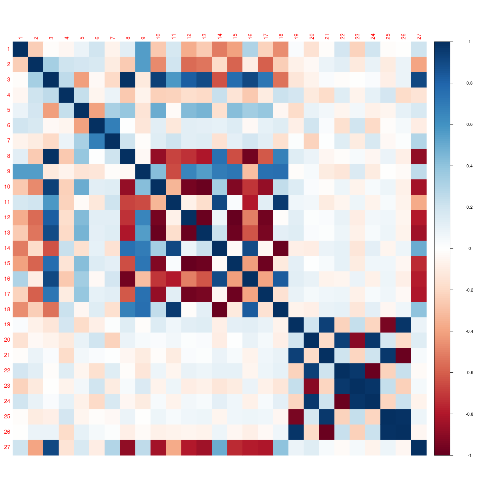

# Kezdő beállítások

## Libraryk

```{r setup, message=FALSE}
knitr::opts_chunk$set(echo = TRUE)

library(tidyverse)
library(plm)
library(splm)
library(sp)
library(spdep)
library(mgcv)
library(lmtest)
library(psych)
library(ppcor)
library(corrplot)
library(lavaan)
library(car)
```

## Adatok beolvasása, átalakítása

```{r read data}
df = read.csv("Data/ExtendedDataset.csv")
```

### CSOK dummy meghatározása

Ez a medián a CSOK-os években

```{r LAKAS median}
median(df$CSOK[df$EV > "2015"])

df$JARAS_NEV = as.factor(df$JARAS_NEV)
df$EV = as.factor(df$EV)
```

A mediánnál elválasztva:

```{r}
cuts = c(-Inf, 1, 75, Inf)
labs = c("nincs", "alacsony", "magas")

df$CSOKTREND = cut(df$CSOK, breaks = cuts, labels = labs, include.lowest = T)

rm(cuts, labs)
```

### Adatok pótlása GAM-al

#### Lakás GAM modell

```{r lakas GAM model}
gammodel = gam(LAKAS ~ s(X,Y, by = EV, k = 8), family = "gaussian", data = df, method = "REML")

predicted = predict(gammodel, df)
df$LAKAS_PRED = df$LAKAS

for (i in 1:nrow(df)) {
  if(is.na(df$LAKAS[i])){
    if(predicted[i] > 0){
      df$LAKAS_PRED[i] = predicted[i]
    }else{
      df$LAKAS_PRED[i] = 0
    }
  }
}

```

#### Eü adatok GAM modelljei

```{r}
sapply(df[,20:37], function(x) sum(is.na(x)))
```

##### FGYHO_SZOLG_SZAM

```{r fgyho GAM model}
gammodel = gam(FGYHO_SZOLG_SZAM  ~ s(X,Y, by = EV, k = 8), family = "gaussian", data = df, method = "REML")

predicted = predict(gammodel, df)

for (i in 1:nrow(df)) {
  if(is.na(df$FGYHO_SZOLG_SZAM[i])){
    if(predicted[i] > 0){
      df$FGYHO_SZOLG_SZAM[i] = predicted[i]
    }else{
      df$FGYHO_SZOLG_SZAM[i] = 0
    }
  }
}

```

##### HGYO_SZAM

```{r hgyo GAM model}
gammodel = gam(HGYO_SZAM ~ s(X,Y, by = EV, k = 8), family = "gaussian", data = df, method = "REML")

predicted = predict(gammodel, df)

for (i in 1:nrow(df)) {
  if(is.na(df$HGYO_SZAM[i])){
    if(predicted[i] > 0){
      df$HGYO_SZAM[i] = predicted[i]
    }else{
      df$HGYO_SZAM[i] = 0
    }
  }
}

rm(i, predicted, gammodel)
```

# Területi autokorreláció

## Szomszédsági mátrixok

### Adatok felbontása Moranhoz és Gearyhez

```{r df evenket felbont}
df2012 = filter(df, EV == 2012)
df2013 = filter(df, EV == 2013)
df2014 = filter(df, EV == 2014)
df2015 = filter(df, EV == 2015)
df2016 = filter(df, EV == 2016)
df2017 = filter(df, EV == 2017)
df2018 = filter(df, EV == 2018)
df2019 = filter(df, EV == 2019)
df2020 = filter(df, EV == 2020)
df2021 = filter(df, EV == 2021)
```

### Szomszédsági mátrixok létrehozása

```{r szomszedsagi mtx}
listw32 = nb2listw(dnearneigh(df2016[,c(9,10)], 0, 32, longlat = T))
listw36 = nb2listw(dnearneigh(df2016[,c(9,10)], 0, 36, longlat = T))
listw40 = nb2listw(dnearneigh(df2016[,c(9,10)], 0, 40, longlat = T))
```

## Területi autokorreláció évente

```{r Moran Geary, echo=TRUE, results='hide'}
# Moran, Geary 2016
moran(df2016$LAKAS_PRED, listw32, 175, 174, zero.policy = NULL, NAOK = F)
moran(df2016$LAKAS_PRED, listw36, 175, 174, zero.policy = NULL, NAOK = F)
moran(df2016$LAKAS_PRED, listw40, 175, 174, zero.policy = NULL, NAOK = F)
geary(df2016$LAKAS_PRED, listw32, 175, 174, Szero(listw32))
geary(df2016$LAKAS_PRED, listw36, 175, 174, Szero(listw36))
geary(df2016$LAKAS_PRED, listw40, 175, 174, Szero(listw40))

# Moran, Geary 2017
moran(df2017$LAKAS_PRED, listw32, 175, 174, zero.policy = NULL, NAOK = F)
moran(df2017$LAKAS_PRED, listw36, 175, 174, zero.policy = NULL, NAOK = F)
moran(df2017$LAKAS_PRED, listw40, 175, 174, zero.policy = NULL, NAOK = F)
geary(df2017$LAKAS_PRED, listw32, 175, 174, Szero(listw32))
geary(df2017$LAKAS_PRED, listw36, 175, 174, Szero(listw36))
geary(df2017$LAKAS_PRED, listw40, 175, 174, Szero(listw40))

# Moran, Geary 2018
moran(df2018$LAKAS_PRED, listw32, 175, 174, zero.policy = NULL, NAOK = F)
moran(df2018$LAKAS_PRED, listw36, 175, 174, zero.policy = NULL, NAOK = F)
moran(df2018$LAKAS_PRED, listw40, 175, 174, zero.policy = NULL, NAOK = F)
geary(df2018$LAKAS_PRED, listw32, 175, 174, Szero(listw32))
geary(df2018$LAKAS_PRED, listw36, 175, 174, Szero(listw36))
geary(df2018$LAKAS_PRED, listw40, 175, 174, Szero(listw40))

# Moran, Geary 2019
moran(df2019$LAKAS_PRED, listw32, 175, 174, zero.policy = NULL, NAOK = F)
moran(df2019$LAKAS_PRED, listw36, 175, 174, zero.policy = NULL, NAOK = F)
moran(df2019$LAKAS_PRED, listw40, 175, 174, zero.policy = NULL, NAOK = F)
geary(df2019$LAKAS_PRED, listw32, 175, 174, Szero(listw32))
geary(df2019$LAKAS_PRED, listw36, 175, 174, Szero(listw36))
geary(df2019$LAKAS_PRED, listw40, 175, 174, Szero(listw40))

# Moran, Geary 2020
moran(df2020$LAKAS_PRED, listw32, 175, 174, zero.policy = NULL, NAOK = F)
moran(df2020$LAKAS_PRED, listw36, 175, 174, zero.policy = NULL, NAOK = F)
moran(df2020$LAKAS_PRED, listw40, 175, 174, zero.policy = NULL, NAOK = F)
geary(df2020$LAKAS_PRED, listw32, 175, 174, Szero(listw32))
geary(df2020$LAKAS_PRED, listw36, 175, 174, Szero(listw36))
geary(df2020$LAKAS_PRED, listw40, 175, 174, Szero(listw40))
```

# Leíró stat

```{r describe evente, results='hide'}
describe(df2012$LAKAS)
describe(df2013$LAKAS)
describe(df2014$LAKAS)
describe(df2015$LAKAS)
describe(df2016$LAKAS)
describe(df2017$LAKAS)
describe(df2018$LAKAS)
describe(df2019$LAKAS)
describe(df2020$LAKAS)
describe(df2021$LAKAS)
```

## Korrelációk

```{r corrplot, fig.width=15, fig.height=15}
cor(df[,c(4:8,14:19)], use = "complete.obs")
corrplot(cor(df[,c(4:8,14:37)], use = "complete.obs"), method = "color")
corrplot(cor(df[,c(4:8,14:37)], use = "complete.obs"), method = "color", addCoef.col = "darkolivegreen")
```

```{r parcialis corrplot, fig.width=15, fig.height=15, error=TRUE}
pcor(na.omit(df[,c(4:8,14:37)]))$estimate
corrplot(pcor(na.omit(df[,c(4:8,14:16,19:37)]))$estimate, method = "color")
```

Nem tudom miert dob error, elozoleg mukodott rendesen.
Azert le van mentve a kep:
```{r}

```


# Panelmodell

## Eü főkomponensek

### Főkomponensek létehozása

```{r fokomp letrehoz}
fokompok = prcomp(df[,c("VEDONO", "HO_FORG_RB", "HO_FORG_OSSZ", "FGYHO_SZOLG_SZAM", "HO_SZOLG_SZAM", "HO_APOLO_SZAM", "HGYO_SZAM")], center = TRUE, scale=TRUE)

summary(fokompok)

```

### Kiválasztás és df-hez adás

```{r}
df = cbind(df, fokompok$x[,1:3])
```

```{r fokom corrplot, fig.width= 7, fig.height=7}
corrplot(cor(df[,c("VEDONO", "HO_FORG_RB", "HO_FORG_OSSZ", "FGYHO_SZOLG_SZAM", "HO_SZOLG_SZAM", "HO_APOLO_SZAM", "HGYO_SZAM", "PC1", "PC2", "PC3")]), method = "color", addCoef.col = "black")
```

Ez így nem jó, nem lehet meghatározni a PC2 és PC3-at, mert mind a VEDONO, mind a HGYO_SZAM korrelál vele.

```{r}
fokompok = prcomp(df[,c("HO_FORG_RB", "HO_FORG_OSSZ", "FGYHO_SZOLG_SZAM", "HO_SZOLG_SZAM", "HO_APOLO_SZAM", "HGYO_SZAM")], center = TRUE, scale=TRUE)

summary(fokompok)
df[,c("PC1", "PC2")] = fokompok$x[,1:2]
```

Akkor a VEDONO és elhagyásával járok jobban(source: próbálgatás).

```{r, fig.width= 7, fig.height=7}
corrplot(cor(df[,c("VEDONO", "HO_FORG_RB", "HO_FORG_OSSZ", "FGYHO_SZOLG_SZAM", "HO_SZOLG_SZAM", "HO_APOLO_SZAM", "HGYO_SZAM", "PC1", "PC2")]), method = "color", addCoef.col = "black")
```

### Főkomponensek elnevezése

Mik lehetnek az egyes főkomponensek?

-   PC1: rendelők nagysága/leterheltsége
-   PC2: gyermekorvosok száma

## Tesztek

```{r tesztek}
phtest(LAKAS_PRED ~ SZJA + MUNKA + BERUHAZAS + CSOKTREND + BUNOZES + SERTETT + PEDAGOGUS + ATLAGAR + VEDONO + PC1 + PC2, df, index = c("JARAS_NEV", "EV"))

pFtest(LAKAS_PRED ~ SZJA + MUNKA + BERUHAZAS + CSOKTREND + BUNOZES + SERTETT + PEDAGOGUS + ATLAGAR + VEDONO + PC1 + PC2, df, index = c("JARAS_NEV", "EV"))
```

Mindkét teszt p-értéke 2.2 $\times$ 10^-16^, vagyis szinte 0. Ezt azt jelenti, hogy mindkét esetben el lehet vetni a nullhipotézist.

A Hausmann teszt nullhipotzise az, hogy a random modell a megfelelő a fix hatásúval szemben. Ezt elvethetjük.

A globális F próba nullhipotézise szerint a Pooled OLS modell a megfelelő, csakugyan a fix hatásúval szemben. Ezt is elvethetjük.

Tehát a panelmodell fix hatású lesz.

## Nem tudom mi legyen a cím itt

```{r nemtom}
df2 = df %>% arrange(EV)
listw36 = nb2listw(dnearneigh(df2[df2$EV == "2016",c(9,10)], 0, 36, longlat = T), style = "W")
```

## Modellek

```{r aic, bic fv-k}
paic = function(model){
  return(2 * (length(model$coefficients) + 1) - 2 * model$logLik)
}

pbic = function(model){
 return(-2 * model$logLik + (length(model$coefficients)+1)*log(nrow(model$model)))
}

```


#### Modell 1

CSOK dummy: "nincs", "alacsony","közepes", "magas"

```{r model1 alap}
cuts = c(-Inf, 1, 70, 86, Inf)
labs = c("nincs", "alacsony","közepes", "magas")
df2$CSOKTREND = cut(df2$CSOK, breaks = cuts, labels = labs, include.lowest = T)

model1_0 = spml(LAKAS_PRED ~ SZJA + MUNKA + BERUHAZAS + CSOKTREND + BUNOZES + SERTETT + PEDAGOGUS + ATLAGAR + VEDONO + PC1 + PC2, df2,
              listw = listw36, model = "within", index = c("JARAS_NEV", "EV"), lag = T,
              effect = "individual", spatial.error = "none")

summary(model1_0)
```

```{r model1 szuk 1}
model1_1 = spml(LAKAS_PRED ~ SZJA  + BERUHAZAS + CSOKTREND  + SERTETT  + ATLAGAR + PC1 + PC2, df2,
              listw = listw36, model = "within", index = c("JARAS_NEV", "EV"), lag = T,
              effect = "individual", spatial.error = "none")

summary(model1_1)
```

```{r model1-ek ic}
paic(model1_0)
paic(model1_1)

pbic(model1_0)
pbic(model1_1)
```

AIC, BIC preferálja a szűkített modellt.

```{r vegso model1}
model1 = model1_1
```

#### Modell 2

CSOK dummy: "nincs", "alacsony", "magas"

```{r model2 alap}
cuts = c(-Inf, 1, 75, Inf)
labs = c("nincs", "alacsony", "magas")
df2$CSOKTREND = cut(df2$CSOK, breaks = cuts, labels = labs, include.lowest = T)
rm(cuts, labs)

model2_0 = spml(LAKAS_PRED ~ SZJA + MUNKA + BERUHAZAS + CSOKTREND + BUNOZES + SERTETT + PEDAGOGUS + ATLAGAR+ VEDONO + PC1 + PC2, df2,
              listw = listw36, model = "within", index = c("JARAS_NEV", "EV"), lag = T,
              effect = "individual", spatial.error = "none")

summary(model2_0)
```


```{r model2 szuk 1}
model2_1 = spml(LAKAS_PRED ~ SZJA + BERUHAZAS + CSOKTREND + SERTETT + ATLAGAR + PC1 + PC2, df2,
              listw = listw36, model = "within", index = c("JARAS_NEV", "EV"), lag = T,
              effect = "individual", spatial.error = "none")

summary(model2_1)
```

```{r model2 ic}
paic(model2_0)
paic(model2_1)

pbic(model2_0)
pbic(model2_1)
```

AIC, BIC preferálja a szűkített modellt.

```{r vegso model2}
model2 = model2_1
```


#### Modell 3

CSOK számként

```{r model3 alap}
model3_0 = spml(LAKAS_PRED ~ SZJA + MUNKA + BERUHAZAS + CSOK + BUNOZES + SERTETT + PEDAGOGUS + ATLAGAR + VEDONO + PC1 + PC2, df2,
              listw = listw36, model = "within", index = c("JARAS_NEV", "EV"), lag = T,
              effect = "individual", spatial.error = "none")

summary(model3_0)
```

```{r model3 szuk 1}
model3_1 = spml(LAKAS_PRED ~ SZJA  + BERUHAZAS + CSOK + SERTETT + ATLAGAR + PC1 + PC2, df2,
              listw = listw36, model = "within", index = c("JARAS_NEV", "EV"), lag = T,
              effect = "individual", spatial.error = "none")

summary(model3_1)
```

```{r model3 szuk 2}
model3_2 = spml(LAKAS_PRED ~ BERUHAZAS + CSOK + SERTETT + ATLAGAR + PC1 + PC2, df2,
              listw = listw36, model = "within", index = c("JARAS_NEV", "EV"), lag = T,
              effect = "individual", spatial.error = "none")

summary(model3_2)
```

```{r model3 ic}
paic(model3_0)
paic(model3_1)
paic(model3_2)

pbic(model3_0)
pbic(model3_1)
pbic(model3_2)
```

AIC modell3_1-et preferálja, BIC modell3_2-t. BIC mellett döntök.

```{r vegso model3}
model3 = model3_2
```


#### Modell 4

CSOK nélkül

```{r model4 alap}
model4_0 = spml(LAKAS_PRED ~ SZJA + MUNKA + BERUHAZAS + BUNOZES + SERTETT + PEDAGOGUS + ATLAGAR + VEDONO + PC1 + PC2, df2,
              listw = listw36, model = "within", index = c("JARAS_NEV", "EV"), lag = T,
              effect = "individual", spatial.error = "none")

summary(model4_0)
```

```{r model4 szuk 1}
model4_1 = spml(LAKAS_PRED ~ SZJA + BERUHAZAS + SERTETT + ATLAGAR + PC1 + PC2, df2,
              listw = listw36, model = "within", index = c("JARAS_NEV", "EV"), lag = T,
              effect = "individual", spatial.error = "none")

summary(model4_1)
```

```{r model4 szuk 2}
model4_2 = spml(LAKAS_PRED ~ BERUHAZAS + SERTETT + ATLAGAR + PC1 + PC2, df2,
              listw = listw36, model = "within", index = c("JARAS_NEV", "EV"), lag = T,
              effect = "individual", spatial.error = "none")

summary(model4_2)
```

```{r model4 szuk 3}
model4_3 = spml(LAKAS_PRED ~ BERUHAZAS + SERTETT + ATLAGAR + PC1, df2,
              listw = listw36, model = "within", index = c("JARAS_NEV", "EV"), lag = T,
              effect = "individual", spatial.error = "none")

summary(model4_3)
```

```{r model4 ic}
paic(model4_0)
paic(model4_1)
paic(model4_2)
paic(model4_3)

pbic(model4_0)
pbic(model4_1)
pbic(model4_2)
pbic(model4_3)
```

AIC modell4_2-t preferalja, BIC modell4_3/t, BIC szerint dontok.

```{r vegso model4}
model4 = model4_3
```

### AIC, BIC

```{r vegso modellek aic bic}

#valamiert nem mukodik a lapply/sapply... -val :/
data.frame(AIC = c(paic(model1), paic(model2), paic(model3), paic(model4)) ,
           BIC = c(pbic(model1), pbic(model2), pbic(model3), pbic(model4)))
```


# SEM

```{r sem}
sem = "
  # measurement model
    EU =~ VEDONO + HO_FORG_RB + HO_FORG_OSSZ + FGYHO_SZOLG_SZAM + HO_SZOLG_SZAM + HO_APOLO_SZAM + HGYO_SZAM
  # regressions
    LAKAS_PRED ~ SZJA + MUNKA + ATLAGAR + EU
  # residual correlations
    ATLAGAR ~~ SZJA + EU
    SZJA ~~ MUNKA + BERUHAZAS + EU
    VEDONO ~~ HO_APOLO_SZAM + HO_SZAM + HO_FORG_OSSZ + HO_FORG_RB
    HO_FORG_RB ~~ HGYO_SZAM + HO_APOLO_SZAM + HO_SZOLG_SZAM + FGYHO_SZOLG_SZAM + HO_FORG_OSSZ 
    HO_FORG_OSSZ ~~ HGYO_SZAM + HO_APOLO_SZAM + HO_SZOLG_SZAM + FGYHO_SZOLG_SZAM
    FGYHO_SZOLG_SZAM ~~ HGYO_SZAM + HO_APOLO_SZAM + HO_SZOLG_SZAM
    HO_SZOLG_SZAM ~~ HO_APOLO_SZAM + HGYO_SZAM
    HO_APOLO_SZAM ~~ HGYO_SZAM
"

fit = sem(sem, data = df2012)
summary(fit, standardized = T)
```
